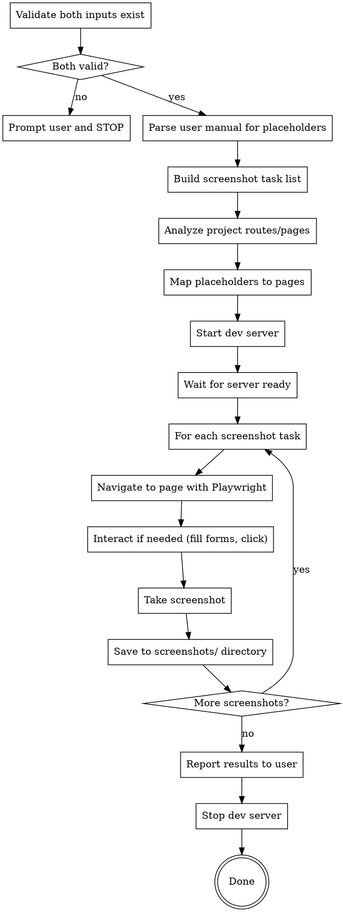

# Auto Capture Screenshots for Web App

## Overview

Automatically capture real screenshots for a user manual by: parsing screenshot placeholders from the manual, starting the web application, navigating to each relevant page with Playwright, and saving screenshots to the manual's `screenshots/` directory with correct filenames.

**Prerequisite skill:** The user manual must be generated by `yanzhi-user-manual-generator:writing-user-manual`, which produces `【图X：description】` placeholders and `screenshots/X-name.png` filenames.

## Environment Check (Run BEFORE Input Validation)

**Verify Playwright MCP is available.** Check the available MCP tools list. The skill requires `mcp__plugin_everything-claude-code_playwright__browser_navigate` and related tools. If Playwright MCP tools are not found:

> Playwright MCP 不可用。auto-capture-for-webapp 依赖 Playwright MCP 进行浏览器截图。请确保已安装并配置 Playwright MCP server。

STOP if Playwright is unavailable — do not attempt to use alternative screenshot methods.

## Input Validation (MANDATORY First Step)

Before ANY other action, verify BOTH inputs exist. If either is missing, prompt the user and STOP.

### Required Input 1: Project Source Code

The user MUST provide a path to a project whose GUI is **exclusively a web frontend** (React, Vue, Next.js, plain HTML, etc.). The project must have a dev server that can be started locally.

**Checklist:**
- [ ] Project path exists and contains source files
- [ ] Project has a `package.json` or equivalent with a dev server script (e.g., `npm run dev`, `yarn dev`, `pnpm dev`)
- [ ] Project GUI is web-only — NOT a CLI, desktop app, mobile app, or TUI

**If project path not provided:** Ask the user and STOP:

> 请提供 web 前端项目的源码路径。该项目的 GUI 必须仅包含 web 前端（如 React、Vue、Next.js 等）。例：`/path/to/your-webapp`

**If project is NOT web-only:** Warn and STOP:

> 该项目不包含纯 web 前端的 GUI。auto-capture-for-webapp 仅支持 web 前端项目。对于 CLI、桌面应用、移动端应用等非 web GUI，无法使用 Playwright 进行截图。

### Required Input 2: User Manual with Screenshot Placeholders

The user MUST provide a user manual (`.md` file) that contains screenshot placeholders in the format `【图X：...】` with corresponding `` image links. This is the output format of the `writing-user-manual` skill.

**Checklist:**
- [ ] User manual file exists and is readable
- [ ] File contains `【图X：` placeholders (at least one)
- [ ] Placeholders have matching `` image links
- [ ] A `screenshots/` directory exists or can be created alongside the manual

**If user manual not provided:** Ask and STOP:

> 请提供用户手册的路径（应包含截图占位符 `【图X：...】`）。该手册应由 `writing-user-manual` skill 生成。例：`/path/to/user-manual/用户手册.md`

**If no placeholders found:** Warn and STOP:

> 在提供的用户手册中未找到截图占位符（`【图X：...】` 格式）。请确认该手册是由 `writing-user-manual` skill 生成且包含了截图占位符。

---

## Workflow



---

## Step 1: Parse User Manual Placeholders

Read the user manual and extract every screenshot placeholder using this pattern:

```
【图X：[功能模块名称] - [界面状态描述]，展示[具体UI元素列表]】

```

**Extract for each placeholder:**
- **Figure number** (`X`) — the sequential number
- **Feature module** — the section/feature name (e.g., "登录页面", "管理后台首页")
- **State description** — expected UI state ("全貌", "填写表单后", "点击提交按钮后")
- **Target filename** — from the markdown image `src` (e.g., `screenshots/1-login-page.png`)
- **Parent section** — which chapter/section heading contains this placeholder

Build a task list. Example:

| # | Section | Description | Filename | Page to Capture |
|---|---------|-------------|----------|-----------------|
| 图1 | 1. 系统登录 | 登录页面全貌 | screenshots/1-login-page.png | `/login` |
| 图2 | 2. 首页概览 | 后台管理首页 | screenshots/2-home-overview.png | `/dashboard` |

## Step 2: Analyze Project and Map Routes

Read the project source code to understand:

1. **How to start the dev server** — check `package.json` scripts (`dev`, `start`, `serve`), or config files (`vite.config.*`, `next.config.*`, `vue.config.*`)
2. **Available routes/pages** — check router config (`react-router`, `vue-router`, Next.js `pages/` or `app/`), or navigation components
3. **Login credentials** (if needed) — check for default credentials in README, `.env.example`, seed data, or source code comments
4. **Port number** — from dev server config or `package.json` scripts

**Map each placeholder to a URL route.** Use these heuristics:

| Placeholder Keywords | Likely Route |
|---------------------|--------------|
| 登录, login, signin | `/login`, `/signin`, `/auth/login` |
| 首页, 概览, dashboard, home | `/`, `/dashboard`, `/home` |
| 注册, register, signup | `/register`, `/signup` |
| 设置, settings, 配置 | `/settings`, `/profile`, `/config` |
| 列表, list, 管理 | Varies — read router config |
| Unknown | Read source code to find the most likely route |

**If a placeholder cannot be mapped to any route:** Mark it as "needs user guidance" and continue with the rest. After processing all mappable screenshots, ask the user to provide the URL for unmapped ones.

## Step 3: Start the Dev Server

1. **Check for port conflicts first** — verify no existing process is using the expected port:
   ```bash
   lsof -i :PORT 2>/dev/null || echo "Port free"
   ```
   If port is occupied, warn the user and ask whether to kill the existing process or use a different port.

2. Install dependencies if needed: `npm install` (or `yarn`, `pnpm install`)
3. Start the dev server in background: `npm run dev &` (use `run_in_background: true`)
4. **Wait for the server to be ready** — poll the expected port until it responds (use `curl` or a Playwright navigation attempt)
5. Record the base URL (e.g., `http://localhost:5173`)

**Server readiness check:**
```bash
# Poll until the dev server responds (max 60s)
for i in $(seq 1 30); do curl -s -o /dev/null http://localhost:PORT && break; sleep 2; done
```

**CRITICAL: NEVER skip the readiness check.** Playwright navigation will fail silently if the server isn't running.

## Step 4: Capture Screenshots with Playwright

For each screenshot task, in order:

### 4.1 Navigate to the Page

Use `mcp__plugin_everything-claude-code_playwright__browser_navigate` to go to the target URL.

```json
{"url": "http://localhost:PORT/route"}
```

### 4.2 Handle Authentication

If the app requires login:
1. Navigate to the login page first
2. Use `browser_fill_form` to enter credentials
3. Click the login button
4. Wait for redirect to complete (`browser_wait_for` with expected text)

### 4.3 Set Up the Required State

Read the placeholder's **state description** carefully. If it says:
- "填写表单后" → fill in the form fields before screenshotting
- "点击提交后" → perform the click, then screenshot the result
- "全貌" or "初始状态" → screenshot the page as-is after navigation
- "展示XX列表" → ensure data is visible; may need to navigate or interact

Use Playwright tools to achieve the required state:
- `browser_fill_form` — fill form fields
- `browser_click` — click buttons, links
- `browser_select_option` — select dropdown options
- `browser_type` — type text into fields
- `browser_wait_for` — wait for specific text/element to appear

### 4.4 Take the Screenshot

Use `browser_take_screenshot` to capture the current page state. **Always use `fullPage: false`** for standard viewport screenshots. Use `fullPage: true` ONLY if the placeholder description explicitly mentions "全页" or "长页面".

```json
{"fullPage": false}
```

### 4.5 Save the Screenshot

The `browser_take_screenshot` tool saves to a default filename. **Rename/move** it to the correct path:

```
{manual_directory}/screenshots/{filename-from-placeholder}
```

Example:
```bash
cp page-2025-01-01T00-00-00-000Z.png /path/to/manual/screenshots/1-login-page.png
```

**CRITICAL:** The filename MUST match exactly what's in the markdown `` — otherwise the image won't render.

### 4.6 Error Recovery

If a screenshot capture fails (navigation timeout, element not found, server crash):

1. **Log the failure** with the reason
2. **Retry once** — refresh the page and try again
3. **If it still fails**, mark as "⚠️ 失败" in the report and continue to the next screenshot
4. **If the dev server has crashed**, restart it before continuing
5. **If a page returns 404**, the route mapping was wrong — try alternative routes or mark for manual capture
6. **NEVER abort the entire batch for one failed screenshot** — capture everything possible, report failures at the end

### 4.7 Complex Authentication

Some apps have authentication flows that Playwright cannot automate:

| Auth Type | Action |
|-----------|--------|
| Username/password | Automate with `browser_fill_form` + `browser_click` |
| OAuth (Google, GitHub, etc.) | **Skip** — ask user to provide a test account with password auth, or manually log in |
| MFA/2FA (SMS, TOTP) | **Skip** — ask user to disable MFA for test account, or manually complete MFA |
| CAPTCHA | **Skip** — ask user to disable CAPTCHA in dev environment, or manually solve |
| Email verification | **Skip** — ask user to provide a pre-verified test account |

**If Playwright cannot complete login automatically:** Open the login page, ask the user to complete authentication manually, then continue with automated screenshot capture.

## Step 5: Verify and Report

After capturing all screenshots:

1. List all files in the `screenshots/` directory
2. Cross-reference with the placeholder task list
3. Report results:

```
## 截图结果

| 序号 | 状态 | 文件名 | 说明 |
|------|------|--------|------|
| 图1  | ✅ 已捕获 | screenshots/1-login-page.png | 登录页面 |
| 图2  | ✅ 已捕获 | screenshots/2-home-overview.png | 首页概览 |
| 图3  | ⚠️ 需手动 | screenshots/3-settings.png | 无法确定对应路由，请手动截图 |
```

4. Stop the dev server (kill the background process)

---

## Red Flags — STOP and Re-evaluate

If you catch yourself thinking any of these, you're about to make a mistake:

- "The user probably meant..." — **Ask, don't assume. Missing inputs = STOP.**
- "I'll just take screenshots of what I can find" — **Parse placeholders first. Don't guess.**
- "The server is probably running" — **Check. Never assume.**
- "I'll figure out the filename later" — **Match filenames exactly from the markdown.**
- "This placeholder is too vague, I'll skip it" — **Mark for user guidance. Don't silently skip.**
- "fullPage: true is safer" — **Use fullPage: false unless explicitly needed.**
- "I'll just use the default port" — **Read project config. Don't hardcode.**
- "The dev server can keep running" — **Clean up. Kill the background process.**

## Common Mistakes

| Mistake | Fix |
|---------|-----|
| Skipping input validation | Always validate BOTH project source AND user manual before proceeding |
| Not verifying web-only GUI | Check project type before starting — reject CLI/desktop/mobile projects |
| Not waiting for dev server to be ready | Poll with curl until the server responds before navigating |
| Not matching filenames exactly | Save screenshots with the EXACT filename from the markdown `` |
| Not setting up page state | Read placeholder descriptions carefully — fill forms, click buttons, wait for states |
| Using wrong port | Check dev server config, not hardcoded ports |
| Screenshotting without login | If the app requires auth, log in first before capturing feature pages |
| Not handling placeholder states | "全貌" ≠ "填写后" — different states need different interactions |
| Giving up on unmappable routes | Mark as "needs guidance" and ask user; don't skip silently |
| Using fullPage for every screenshot | Only use `fullPage: true` when placeholder explicitly mentions full-page/long-page |
| Not killing dev server after done | Clean up background processes when finished |
| Assuming default credentials work | Check README, `.env.example`, seed scripts for actual test credentials |

## Quick Reference

### Placeholder Parsing Regex

```
【图(\d+)：[^】]*】\n!\[图\d+\]\(screenshots\/([^)]+)\)
```

Capture groups: `$1` = figure number, `$2` = filename

### Dev Server Start Commands (by framework)

| Framework | Typical Dev Command | Default Port |
|-----------|-------------------|---------------|
| Vite (React/Vue) | `npm run dev` | 5173 |
| Next.js | `npm run dev` | 3000 |
| Create React App | `npm start` | 3000 |
| Vue CLI | `npm run serve` | 8080 |
| Angular | `ng serve` | 4200 |
| SvelteKit | `npm run dev` | 5173 |

### Placeholder State → Action Mapping

| State Keywords | Required Interaction |
|---------------|---------------------|
| 全貌, 初始状态, overview | Navigate only, no interaction needed |
| 填写后, 输入后, after filling | Fill relevant form fields first |
| 点击后, 提交后, after clicking | Perform the click/submit, then screenshot result |
| 展开, 下拉, expanded | Click to expand dropdown/accordion first |
| 弹窗, 对话框, modal | Trigger the modal/dialog, then screenshot |
| 错误, 校验, error | Trigger validation errors intentionally |
