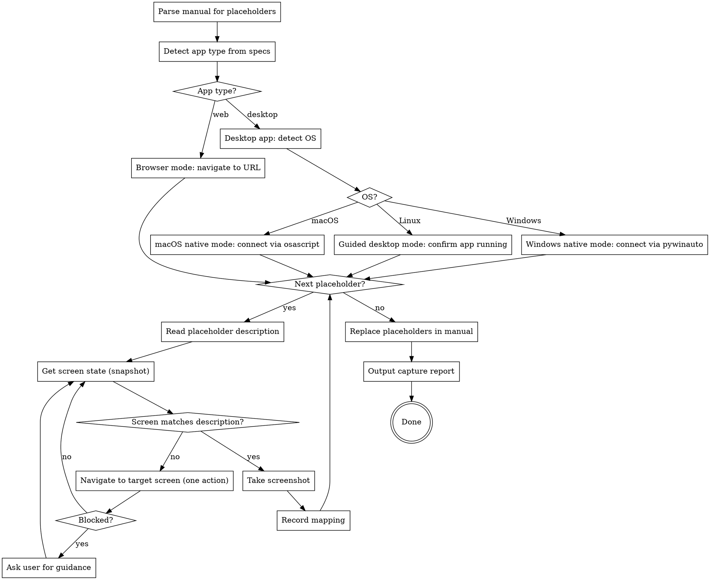

# Auto Capture Screenshots

## Overview

Automatically capture screenshots for every placeholder in a user manual by interactively navigating the running application. Uses a **snapshot-analyze-act** loop — never a blind script — to understand each screen, decide what to click, and verify before capturing.

Supports four capture modes:
- **Browser mode** — web apps via Playwright MCP tools
- **Windows native mode** — WPF/WinForms apps via `pywinauto` (automatic interaction on Windows)
- **macOS native mode** — Cocoa/AppKit apps via `osascript` / AppleScript (automatic interaction on macOS)
- **Guided desktop mode** — any desktop app where native automation is unavailable (Linux, or when automation fails)

## When to Use

- User provides a user manual containing `【图X：...】` screenshot placeholders
- User provides specs/source codes so you understand the app's navigation structure
- The target application is running (web app via URL, or desktop app like WPF/WinForms/Electron)
- User asks to "fill in screenshots", "auto capture", "自动截图"

## Prerequisites

1. **User manual** — markdown file with `【图X：...】` placeholders
2. **Specs/source codes** — to understand navigation paths and UI labels
3. **Running application** — web app at a URL, or desktop app (WPF, WinForms, Electron, etc.) open on screen

**REQUIRED SUB-SKILL:** Use `writing-user-manual` — this skill complements the manual generated by that skill.

## App Type Detection

Determine the app type from specs/source codes before starting:

| Signal in specs/source | App Type | Capture Mode |
|------------------------|----------|-------------|
| URLs, routes, HTML, React/Vue/Angular | Web app | Browser mode (Playwright MCP) |
| WPF (`Window`, `UserControl`, XAML, `.csproj` with `PresentationCore`) | Desktop (WPF) | Windows native mode (if on Windows), else Guided desktop |
| WinForms (`Form`, `.csproj` with `System.Windows.Forms`) | Desktop (WinForms) | Windows native mode (if on Windows), else Guided desktop |
| Electron (`electron`, `BrowserWindow`) | Desktop (Electron) | Browser mode (may work with URL) |
| Qt, Swing, Flutter desktop | Desktop (native) | macOS native mode (if macOS), else Guided desktop |
| Cocoa/AppKit (`NSWindow`, `UIKit`, `.app` bundle, Swift/Objective-C) | Desktop (macOS native) | macOS native mode |

If unclear, ask the user: "请确认应用类型：1) Web应用（浏览器访问） 2) 桌面应用（如WPF/WinForms）"

### OS Detection for Desktop Mode

After detecting a desktop app, determine the current OS via `Bash`:

```
uname -s    # "Darwin" = macOS, "Linux" = Linux, "MINGW"/"MSYS"/"Windows_NT" = Windows
```

- **Windows** → use Windows native mode (pywinauto)
- **macOS** → use macOS native mode (osascript)
- **Linux** → use Guided desktop mode

## Core Principle: Snapshot-Analyze-Act

**NEVER write a monolithic script.** For every interaction:

1. **Snapshot** — take a snapshot of the current UI state (accessibility snapshot for browser, control tree for Windows native, user confirmation for guided)
2. **Analyze** — read the snapshot, understand what's on screen, compare with the placeholder description
3. **Act** — perform ONE action (click, type, navigate) to move closer to the target state
4. **Verify** — snapshot again, confirm the action succeeded
5. **Repeat** until the screen matches the placeholder description, then capture

This ensures every action is informed by the actual screen state, not assumptions.

## Workflow



### Step 1: Parse Placeholders

Extract all `【图X：...】` from the user manual. For each, record:

- Placeholder ID (e.g., `图1`)
- Description text (e.g., `登录页面全貌，展示Logo、输入框、按钮布局`)
- Section context (which chapter/feature it belongs to)

Sort placeholders in the order they appear in the manual — this often follows the natural navigation flow of the app.

### Step 2: Connect to Application

#### Browser Mode (Web Apps)

Search specs/source codes for the application URL. Common locations:
- Config files (dev server port, base URL)
- README or setup docs
- Environment variable defaults

If not found, ask the user: "请提供应用的访问地址（如 http://localhost:3000）。"

Use `browser_navigate` to open the app.

#### Windows Native Mode (WPF/WinForms on Windows)

Connect to the running application using `pywinauto` via `Bash` commands.

**Setup check** — verify `pywinauto` is installed:

```bash
python -c "import pywinauto; print(pywinauto.__version__)"
```

If not installed, run:

```bash
pip install pywinauto
```

**Connect to app** — find the application window and print its control tree:

```python
python -c "
from pywinauto import Desktop
desktop = Desktop(backend='uia')
# List all top-level windows
for w in desktop.windows():
    print(f'{w.window_text()} | class={w.class_name()} | pid={w.process_id()}')
"
```

Identify the target window from the output (match by title or class name). Then connect:

```python
python -c "
from pywinauto import Desktop
desktop = Desktop(backend='uia')
app_window = desktop.window(title='App Title Here')
app_window.set_focus()
print('Connected to:', app_window.window_text())
"
```

**Snapshot control tree** — print the current UI structure:

```python
python -c "
from pywinauto import Desktop
desktop = Desktop(backend='uia')
win = desktop.window(title='App Title Here')
win.print_control_identifiers(depth=3)
"
```

This outputs the control tree with names, types, and identifiers — equivalent to `browser_snapshot` for web apps.

#### Guided Desktop Mode (Linux)

For desktop apps on Linux, or when native automation is unavailable:

1. Ask the user to confirm the app is running and visible on screen
2. Guide the user with step-by-step instructions (which buttons/menus to click)
3. Use system screenshot commands for capture
4. Ask the user: "应用是否已打开？我将引导您逐步导航并截取屏幕截图。"

#### macOS Native Mode (Cocoa/AppKit Apps)

Connect to the running application using `osascript` (AppleScript) via `Bash` commands.

**Prerequisite** — grant Accessibility permissions:

> **System Settings → Privacy & Security → Accessibility** — add Terminal (or the app running Claude Code) to the allowed list. Without this, `osascript` cannot inspect or control other apps.

Verify accessibility access:

```bash
osascript -e 'tell application "System Events" to get name of every process whose background only is false'
```

If this returns an error about assistive access, remind the user to grant permissions.

**List running apps** — find the target application:

```bash
osascript -e 'tell application "System Events" to get name of every process whose background only is false'
```

**Bring app to front:**

```bash
osascript -e 'tell application "AppName" to activate'
```

**Snapshot UI element tree** — print the current window structure:

```bash
osascript -e '
tell application "System Events"
    tell process "AppName"
        set uiElements to entire contents of window 1
        repeat with elem in uiElements
            set elemClass to class of elem as text
            set elemName to ""
            try
                set elemName to name of elem
            end try
            set elemDesc to ""
            try
                set elemDesc to description of elem
            end try
            log elemClass & " | " & elemName & " | " & elemDesc
        end repeat
    end tell
end tell
' 2>&1
```

This outputs element types, names, and descriptions — equivalent to `browser_snapshot` for web apps or `print_control_identifiers` for pywinauto.

**Note:** The first snapshot may take a few seconds. For faster iteration, use a focused depth by targeting specific containers (e.g., `group 1 of window 1`) instead of `entire contents of window 1`.

### Step 3: Capture Loop

For each placeholder, execute the capture loop:

#### 3a. Analyze Description

From the placeholder description, determine:
- Which page/screen is needed
- What state the page should be in (logged in? form filled? data loaded?)
- What UI elements should be visible

Use the specs/source codes to map the description to a navigation path (which menus to click, which pages to visit).

#### 3b. Navigate to Target Screen

##### Browser Mode

Using the **snapshot-analyze-act** loop:

1. Take accessibility snapshot: `browser_snapshot`
2. Compare current screen state with target state
3. If not on target screen: identify the next action (click a menu, navigate to a URL, fill a form)
4. Perform ONE action
5. Go back to step 1

**Navigation shortcuts:**
- If you know the exact URL from specs, use `browser_navigate` directly
- If you need to click through menus, use `browser_snapshot` + `browser_click`
- If you need to fill forms first (e.g., login), use `browser_type`

##### Windows Native Mode

Using the **snapshot-analyze-act** loop via `Bash`:

1. **Snapshot** — print the control tree to understand current state:

```python
python -c "
from pywinauto import Desktop
desktop = Desktop(backend='uia')
win = desktop.window(title='App Title Here')
win.print_control_identifiers(depth=3)
"
```

2. **Analyze** — read the control tree output, identify what's visible (buttons, menus, text fields, tabs, tree items)
3. **Act** — perform ONE action using `Bash`:

**Click a button/menu item:**

```python
python -c "
from pywinauto import Desktop
desktop = Desktop(backend='uia')
win = desktop.window(title='App Title Here')
# Click by exact text or best_match
win.child_window(title='课程管理', control_type='MenuItem').click()
"
```

**Type into a text field:**

```python
python -c "
from pywinauto import Desktop
desktop = Desktop(backend='uia')
win = desktop.window(title='App Title Here')
field = win.child_window(control_type='Edit', found_index=0)
field.set_text('input text here')
"
```

**Select a tree item / list item:**

```python
python -c "
from pywinauto import Desktop
desktop = Desktop(backend='uia')
win = desktop.window(title='App Title Here')
win.child_window(title='目标项名称', control_type='TreeItem').select()
"
```

**Click a tab:**

```python
python -c "
from pywinauto import Desktop
desktop = Desktop(backend='uia')
win = desktop.window(title='App Title Here')
win.child_window(title='设置', control_type='TabItem').select()
"
```

**Send keyboard shortcuts:**

```python
python -c "
from pywinauto import Desktop
desktop = Desktop(backend='uia')
win = desktop.window(title='App Title Here')
win.type_keys('%F')  # Alt+F
win.type_keys('^s')  # Ctrl+S
win.type_keys('{ENTER}')
"
```

4. **Verify** — snapshot the control tree again to confirm the action succeeded
5. **Repeat** until the target screen state is reached

**Key rules:**
- Each `Bash` call runs a fresh Python process — do NOT rely on variables between calls
- Always re-discover the window handle (`desktop.window(...)`) in each call
- Use `control_type` to narrow matches: `Button`, `MenuItem`, `Edit`, `TabItem`, `TreeItem`, `ListItem`, `Text`, `DataGrid`
- Use `found_index=0` when multiple controls match and you need the first one
- Use `best_match` as a fallback: `win.child_window(best_match='OK')`

##### Guided Desktop Mode

For desktop apps without native automation (Linux):

1. From the specs/source codes, determine the navigation path to the target screen
2. Tell the user exactly what to click:

> 请在应用中执行以下操作：
> 1. 点击左侧菜单 **"课程管理"**
> 2. 点击 **"新建课程"** 按钮
>
> 完成后请回复"ok"，我将截取当前屏幕。

3. Wait for user confirmation
4. Proceed to screenshot capture

**Alternative: keyboard-driven navigation.** If the app supports keyboard shortcuts (found in specs), guide the user with keystrokes:

> 请按以下快捷键导航：
> 1. 按 **Alt+F** 打开文件菜单
> 2. 按 **N** 选择新建
>
> 完成后回复"ok"。

##### macOS Native Mode

Using the **snapshot-analyze-act** loop via `Bash`:

1. **Snapshot** — print the UI element tree to understand current state (see Step 2 "Snapshot UI element tree")
2. **Analyze** — read the element tree output, identify what's visible (buttons, menus, text fields, tabs, outlines)
3. **Act** — perform ONE action using `Bash`:

**Click a menu item:**

```bash
osascript -e '
tell application "System Events"
    tell process "AppName"
        click menu item "课程管理" of menu "功能" of menu bar 1
    end tell
end tell
'
```

**Click a button:**

```bash
osascript -e '
tell application "System Events"
    tell process "AppName"
        click button "确定" of window 1
    end tell
end tell
'
```

**Type into a text field:**

```bash
osascript -e '
tell application "System Events"
    tell process "AppName"
        set focused of text field 1 of window 1 to true
        keystroke "input text here"
    end tell
end tell
'
```

**Clear and type into a field:**

```bash
osascript -e '
tell application "System Events"
    tell process "AppName"
        set focused of text field 1 of window 1 to true
        keystroke "a" using command down
        keystroke "replacement text"
    end tell
end tell
'
```

**Send keyboard shortcuts:**

```bash
osascript -e '
tell application "System Events"
    tell process "AppName"
        keystroke "s" using command down  -- Cmd+S
        keystroke "n" using {command down, shift down}  -- Cmd+Shift+N
        key code 36  -- Enter
        key code 48  -- Tab
        key code 51  -- Delete
        key code 53  -- Escape
    end tell
end tell
'
```

**Select a tab:**

```bash
osascript -e '
tell application "System Events"
    tell process "AppName"
        click radio button "设置" of radio group 1 of tab group 1 of window 1
    end tell
end tell
'
```

**Select a row in a table/outline:**

```bash
osascript -e '
tell application "System Events"
    tell process "AppName"
        select row 2 of table 1 of scroll area 1 of window 1
    end tell
end tell
'
```

**Get properties of a specific element** (for precise analysis):

```bash
osascript -e '
tell application "System Events"
    tell process "AppName"
        set props to properties of window 1
        set elemList to every UI element of window 1
        repeat with elem in elemList
            try
                log (class of elem as text) & ": " & (name of elem)
            end try
        end repeat
    end tell
end tell
' 2>&1
```

4. **Verify** — snapshot the UI element tree again to confirm the action succeeded
5. **Repeat** until the target screen state is reached

**Key rules:**
- Each `Bash` call runs `osascript` independently — do NOT rely on AppleScript variables between calls
- Always re-target the process (`tell process "AppName"`) in every call
- AppleScript element hierarchy: `menu bar 1 → menu "File" → menu item "Save"`, `window 1 → group 1 → button "OK"`
- Use index-based access when element names are dynamic: `text field 1`, `button 2 of group 1`
- Use `try/end try` to handle elements that may not exist on the current screen
- If `entire contents` is too slow, target specific containers: `entire contents of group 1 of window 1`

**macOS key codes (common):**

| Key | Code | Key | Code |
|-----|------|-----|------|
| Enter | 36 | Tab | 48 |
| Delete | 51 | Escape | 53 |
| Space | 49 | Up | 126 |
| Down | 125 | Left | 123 |
| Right | 124 | Home | 115 |
| End | 119 | Page Up | 116 |
| Page Down | 121 | F1 | 122 |

**macOS modifier keys:** `command down`, `shift down`, `option down`, `control down`

#### 3c. Handle Blocks

If you cannot find a widget, the page looks unexpected, or you're stuck:

1. Take a screenshot to show the user the current state
2. Ask via AskUserQuestion:
   - Describe what you see on screen
   - Describe what you expected to find
   - Ask: "当前页面与预期不符。请选择：1) 手动导航到目标页面后通知我继续截图 2) 提供导航指引 3) 跳过此截图"
3. If user navigates manually → wait, then snapshot and continue
4. If user provides guidance → follow it
5. If user says skip → mark as skipped, move to next

**Windows native mode fallback:** If `pywinauto` cannot find a control or the action fails:
- Print the current control tree and analyze what's available
- If the control tree shows unexpected structure, adjust the selector
- After 3 failed attempts, fall back to guided mode for this placeholder
- Ask user: "自动操作遇到困难。请手动导航到目标页面后通知我，或提供操作指引。"

**macOS native mode fallback:** If `osascript` cannot find an element or the action fails:
- Print the current UI element tree and analyze what's available
- If the element hierarchy is unexpected, adjust the selector (try index-based access)
- After 3 failed attempts, fall back to guided mode for this placeholder
- Ask user: "自动操作遇到困难。请手动导航到目标页面后通知我，或提供操作指引。"

#### 3d. Capture Screenshot

When the screen matches the description:

**Browser mode:**
1. Use `browser_take_screenshot` to capture
2. Save to `screenshots/` directory

**Windows native mode:**
1. Use `Bash` to capture the window via `pywinauto`:

```python
python -c "
from pywinauto import Desktop
import os
os.makedirs('screenshots', exist_ok=True)
desktop = Desktop(backend='uia')
win = desktop.window(title='App Title Here')
win.capture_as_image().save('screenshots/图1-登录页面.png')
print('Screenshot saved.')
"
```

**macOS native mode:**
1. Use `Bash` to capture the window via `screencapture`:

```bash
mkdir -p screenshots && screencapture -w screenshots/图1-登录页面.png
```

Or capture a specific window by getting its bounds first:

```bash
osascript -e '
tell application "System Events"
    tell process "AppName"
        set pos to position of window 1
        set sz to size of window 1
        set x to item 1 of pos
        set y to item 2 of pos
        set w to item 1 of sz
        set h to item 2 of sz
        do shell script "screencapture -R " & x & "," & y & "," & w & "," & h & " screenshots/图1-登录页面.png"
    end tell
end tell
'
```

**Guided desktop mode (Linux):**
1. Ask the user to take a screenshot, or use a system screenshot command
2. Or ask user to provide the screenshot file path
3. If the user provides a screenshot file, copy it to `screenshots/` with a descriptive name

**All modes:**
3. Save to a file named descriptively: `screenshots/图1-登录页面.png`, `screenshots/图2-首页概览.png`
4. Record the mapping

### Step 4: Replace Placeholders

After all screenshots are captured:

1. Read the original manual
2. Replace each `【图X：...】` with the corresponding screenshot image reference:

```markdown

```

3. Write the updated manual to a **new file** (never overwrite the original)

### Step 5: Output Capture Report

Output a summary table in the terminal (NOT in the output file):

```
## 截图捕获报告

| 占位符 | 状态 | 截图文件 | 备注 |
|--------|------|---------|------|
| 图1 | 成功 | screenshots/图1-登录页面.png | |
| 图3 | 跳过 | — | 用户手动跳过 |
| 图7 | 成功 | screenshots/图7-统计面板.png | 需要手动填入测试数据 |
```

Status types: **成功** (captured), **跳过** (skipped), **需手动** (needs manual intervention)

## Tool Usage Reference

### Browser Mode (Web Apps)

| Action | Tool | Notes |
|--------|------|-------|
| Read current screen | `browser_snapshot` | Always use before acting |
| Navigate to URL | `browser_navigate` | When you know the exact URL |
| Click element | `browser_click` | Use `ref` from snapshot |
| Type into field | `browser_type` | Use `ref` from snapshot |
| Take screenshot | `browser_take_screenshot` | Save to `screenshots/` directory |
| Wait for page load | `browser_wait_for` | After navigation or clicks |

### Windows Native Mode (WPF/WinForms on Windows)

| Action | Bash Command | Notes |
|--------|-------------|-------|
| List windows | `python -c "from pywinauto import Desktop; ..."` | `Desktop(backend='uia').windows()` |
| Snapshot control tree | `win.print_control_identifiers(depth=3)` | Equivalent to `browser_snapshot` |
| Click button/menu | `win.child_window(title='X', control_type='Button').click()` | ONE action per call |
| Type into field | `field.set_text('value')` | Use `control_type='Edit'` |
| Select tree/list item | `win.child_window(title='X', control_type='TreeItem').select()` | For navigation trees |
| Select tab | `win.child_window(title='X', control_type='TabItem').select()` | For tab controls |
| Send keys | `win.type_keys('%F')` | `%`=Alt, `^`=Ctrl, `{ENTER}`, `{TAB}` |
| Take screenshot | `win.capture_as_image().save('path.png')` | Saves window as PNG |
| Verify state | Re-run `print_control_identifiers` | After each action |

**pywinauto key modifiers:** `%` = Alt, `^` = Ctrl, `+` = Shift. Special keys: `{ENTER}`, `{TAB}`, `{ESC}`, `{BACK}`, `{DELETE}`, `{UP}`, `{DOWN}`, `{LEFT}`, `{RIGHT}`.

### macOS Native Mode (Cocoa/AppKit Apps on macOS)

| Action | Bash Command | Notes |
|--------|-------------|-------|
| List running apps | `osascript -e 'tell app "System Events" to get name of every process...'` | Find target app name |
| Snapshot UI tree | `entire contents of window 1 of process "X"` via osascript | Equivalent to `browser_snapshot` |
| Get specific elements | `every UI element of window 1` + log class & name | Focused inspection |
| Bring app to front | `tell application "X" to activate` | Before interacting |
| Click menu item | `click menu item "X" of menu "Y" of menu bar 1` | Menu bar actions |
| Click button | `click button "X" of window 1` | Dialogs, toolbars |
| Type into field | `set focused of text field N to true` then `keystroke "text"` | Index-based targeting |
| Send keys | `keystroke "s" using command down` | `command`, `shift`, `option`, `control` |
| Press key by code | `key code 36` (Enter) | See key code table above |
| Select tab | `click radio button "X" of radio group 1 of tab group 1` | Tab controls |
| Select table row | `select row N of table 1 of scroll area 1` | Table/list views |
| Take screenshot | `screencapture -R x,y,w,h path.png` or `screencapture -w path.png` | Window or region capture |
| Verify state | Re-run UI tree snapshot | After each action |

### Guided Desktop Mode (Linux)

| Action | Method | Notes |
|--------|--------|-------|
| Navigate to screen | Guide user with exact steps | Tell user which menus/buttons to click |
| Keyboard shortcuts | Guide user with keystrokes | More reliable than mouse clicks |
| Take screenshot | `screencapture` (macOS) or ask user | `screencapture -w` for window, `screencapture` for full screen |
| Verify screen state | Ask user to confirm | "请确认当前页面是否显示XXX？" |
| Handle blocks | Ask user for help | Same as browser mode block handling |

## Smart Navigation

Use specs/source codes to build a mental map of the app before starting:

- **Route structure** (web) / **Window hierarchy** (desktop) — which screens map to which features
- **Menu labels** — exact text labels for navigation clicks
- **Login flow** — credentials needed to access the app
- **Form fields** — required fields and default values for reaching specific states
- **Keyboard shortcuts** (desktop) — `Alt+X` access keys, tab order, shortcut keys
- **Window navigation** (desktop) — which dialogs open from which buttons, tab control structure

If the app requires authentication, handle login first before starting the capture loop.

### Desktop-Specific Tips

- **WPF XAML files** contain exact button names, menu items, and tab headers — read them to get precise UI labels
- **Access keys** are often defined as `_` prefix in XAML (e.g., `_File` means Alt+F)
- **Tab order** is defined by `KeyboardNavigation.TabNavigation` — useful for form-filling guidance
- **Dialog results** — know which buttons close dialogs vs open new windows

### macOS Native Mode Tips

- **Accessibility permissions are required** — `osascript` cannot control other apps without System Settings → Privacy & Security → Accessibility access
- **Element hierarchy in AppleScript**: `window 1 → group 1 → button "OK"`, `menu bar 1 → menu "File" → menu item "Save"`
- **Use `try/end try`** — many elements don't support all properties (e.g., `name` may not exist). Wrap in try blocks to avoid script errors
- **Index-based vs name-based** — prefer name-based selectors (`button "确定"`), fall back to index (`button 1 of group 2`) when names are empty or dynamic
- **`entire contents` can be slow** — for complex windows, target specific containers (`entire contents of group 1 of window 1`) instead of the whole window
- **Sheet windows** — macOS sheets (e.g., Save dialogs) are children of the parent window: `sheet 1 of window 1`
- **`log` outputs to stderr** — use `2>&1` in Bash to capture `log` output
- **Window numbering** — windows are indexed front-to-back; `window 1` is the frontmost

### Windows Native Mode Tips

- **Always use `backend='uia'`** — the UIA backend supports WPF and modern WinForms controls
- **Use `print_control_identifiers(depth=3)`** — depth 3 is usually enough; increase to 4-5 for complex nested layouts
- **`child_window()` selectors** — prefer `title` + `control_type` for precise matching. Fallback to `best_match` or `found_index`
- **Dialogs and popups** — after clicking a button that opens a dialog, the dialog is a child of the main window. Use `win.child_window(title='Dialog Title')` or `win.child_window(control_type='Window')` to find it
- **Data grids** — WPF `DataGrid` may expose as `control_type='DataGrid'` or `control_type='Table'`. Iterate rows with `.get_item(row_index)`
- **Stateless approach** — each `Bash` call is a fresh process. Re-discover the window in every call. Do NOT try to share Python objects between calls

## Common Mistakes

| Mistake | Fix |
|---------|-----|
| Writing a monolithic Playwright/pywinauto script | Use interactive snapshot-analyze-act loop |
| Clicking without checking screen state | Always snapshot before acting |
| Assuming element locations | Use `ref` from accessibility snapshot / control tree |
| Ignoring page load timing | Wait after navigation actions |
| Overwriting original manual | Always write to a new file |
| Capturing wrong screen state | Verify with snapshot before taking screenshot |
| Getting stuck in a loop | Set a max retry count per placeholder (5), then ask user |
| Not creating screenshots directory | Create `screenshots/` before starting captures |
| Sharing Python objects between Bash calls | Each call is a fresh process; re-discover window every time |
| Using `backend='win32'` for WPF | Always use `backend='uia'` for WPF/WinForms |
| Wrong `control_type` in pywinauto selector | Print control tree first to see exact types |
| Not handling dialog popups in Windows mode | After action, re-snapshot to detect new dialogs |
| Missing macOS Accessibility permissions | Remind user to grant access in System Settings → Privacy & Security → Accessibility |
| Slow `entire contents` on macOS | Target specific containers instead of full window |
| Not using `try/end try` in AppleScript | Many elements lack expected properties; wrap in try blocks |
| Assuming macOS element names exist | Fall back to index-based access when names are empty |
