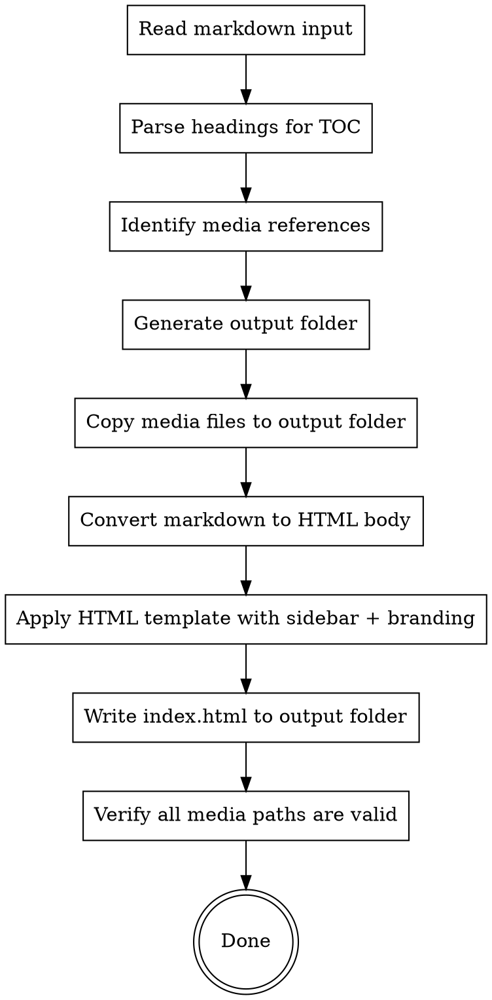

# Generating HTML Manual

## Overview

Convert a Markdown user manual into a self-contained, styled HTML page with sidebar catalogue navigation, back-to-top button, and company branding. Output is a folder containing the HTML file plus all referenced media assets.

## When to Use

- User provides a Markdown user manual (`.md` file) and wants an HTML version
- User asks to "convert manual to HTML", "generate HTML manual", "转HTML", "生成HTML手册"
- Default language: **Simplified Chinese** unless user specifies otherwise

## Prerequisites

1. **Markdown user manual** — the `.md` file to convert
2. **Media files** — any images or assets referenced in the markdown (relative paths)

**REQUIRED REFERENCE:** Read `color-spec.md` in this skill's directory for the complete color system and design tokens.

## Workflow



### Step 1: Read and Parse

1. Read the input markdown file
2. Parse all headings (`##` and `###`) to build the sidebar TOC
3. Scan for media references: ``, ``, `[text](path.pdf)` etc.
4. Record the relative paths of all referenced media files

### Step 2: Create Output Folder

1. Create a new folder next to the input markdown file, named `{manual-name}-html/`
2. Create `media/` subfolder inside it for copied assets
3. Copy all referenced media files from their original locations to `media/`
4. Copy the company logo files from this skill's `company_style/` directory to `media/`

### Step 3: Convert Markdown to HTML

Convert the markdown content to well-structured HTML:

| Markdown | HTML |
|----------|------|
| `## Heading` | `<h2 id="slug">Heading</h2>` |
| `### Heading` | `<h3 id="slug">Heading</h3>` |
| `**bold**` | `<strong>bold</strong>` |
| `> **note**: text` | `<blockquote class="callout-tip"><strong>说明：</strong>text</blockquote>` |
| `> **warning**: text` | `<blockquote class="callout-warning"><strong>注意：</strong>text</blockquote>` |
| `` | `<figure><figcaption>alt</figcaption></figure>` |
| `【图X：...】` | `<figure class="screenshot-placeholder"><div class="placeholder-box"><span>图X</span></div><figcaption>...</figcaption></figure>` |
| Tables | Standard `<table>` with `<thead>` and `<tbody>` |
| `1. item` | `<ol><li>item</li></ol>` |
| `- item` | `<ul><li>item</li></ul>` |
| `` `code` `` | `<code>code</code>` |
| Code blocks | `<pre><code>...</code></pre>` |

**Heading ID slugs:** Generate from heading text — lowercase, replace spaces/special chars with hyphens, ensure uniqueness by appending `-2`, `-3` etc. for duplicates.

**Media path rewrite:** All media references in the HTML must point to `media/` relative path.

### Step 4: Apply HTML Template

Use the complete HTML template below. Insert the converted content into `<!-- CONTENT START -->` / `<!-- CONTENT END -->` markers and the TOC into `<!-- TOC START -->` / `<!-- TOC END -->` markers.

**Placeholders to fill in the template:**
- `{{TITLE}}` — manual title (first `#` heading or filename)
- `{{VERSION}}` — version string if found (e.g., "V2.3.0"), otherwise empty
- `{{CONTENT}}` — converted HTML body from Step 3
- `{{TOC}}` — generated sidebar TOC from headings

### Step 5: Verify

After writing `index.html`:
1. Check all `src="media/..."` references point to files that exist in the output folder
2. If any media files are missing, warn the user with the list of missing files
3. Report the output folder path to the user

## HTML Template

```html
<!DOCTYPE html>
<html lang="zh-CN">
<head>
  <meta charset="UTF-8">
  <meta name="viewport" content="width=device-width, initial-scale=1.0">
  <title>{{TITLE}}</title>
  <style>
    :root {
      /* 主色蓝灰 */
      --primary-900: #3d5580;
      --primary-700: #657eae;
      --primary-500: #8a9ec5;
      --primary-200: #e8edf5;
      --primary-100: #f4f6fa;

      /* 强调色橙 */
      --accent-900: #c55800;
      --accent-700: #ed6c00;
      --accent-500: #f5a623;
      --accent-200: #fff3e6;

      /* 中性色 */
      --neutral-900: #1a1a2e;
      --neutral-700: #2d3748;
      --neutral-500: #4a5568;
      --neutral-400: #718096;
      --neutral-200: #e2e8f0;
      --neutral-100: #f5f7fa;

      /* 语义色 */
      --success-bg: #eafbef; --success-border: #38a169; --success-text: #276749;
      --warning-bg: #fff8ed; --warning-border: #f5a623; --warning-text: #7a5a12;
      --danger-bg: #fef2f2;  --danger-border: #e53e3e;  --danger-text: #9b2c2c;
      --info-bg: #e8edf5;    --info-border: #657eae;    --info-text: #3d5580;

      /* 渐变 */
      --gradient-hero: linear-gradient(135deg, #3d5580 0%, #657eae 100%);
      --gradient-table: linear-gradient(135deg, #657eae, #8a9ec5);
      --gradient-btn: linear-gradient(135deg, #ed6c00, #f5a623);

      /* 布局 */
      --sidebar-width: 280px;
      --header-height: 64px;
    }

    * { margin: 0; padding: 0; box-sizing: border-box; }

    body {
      font-family: -apple-system, BlinkMacSystemFont, "Segoe UI", "PingFang SC", "Hiragino Sans GB", "Microsoft YaHei", sans-serif;
      color: var(--neutral-700);
      background: var(--neutral-100);
      line-height: 1.8;
    }

    /* ===== Header ===== */
    .header {
      position: fixed;
      top: 0; left: 0; right: 0;
      height: var(--header-height);
      background: var(--gradient-hero);
      display: flex;
      align-items: center;
      padding: 0 24px;
      z-index: 100;
      box-shadow: 0 2px 8px rgba(0,0,0,0.15);
    }
    .header-logo {
      height: 40px;
      margin-right: 16px;
    }
    .header-title {
      color: #fff;
      font-size: 18px;
      font-weight: 600;
      white-space: nowrap;
      overflow: hidden;
      text-overflow: ellipsis;
    }
    .header-version {
      color: rgba(255,255,255,0.7);
      font-size: 13px;
      margin-left: 12px;
      white-space: nowrap;
    }
    .sidebar-toggle {
      display: none;
      background: rgba(255,255,255,0.15);
      border: none;
      color: #fff;
      width: 36px; height: 36px;
      border-radius: 6px;
      cursor: pointer;
      margin-right: 12px;
      font-size: 20px;
      line-height: 1;
    }
    .sidebar-toggle:hover { background: rgba(255,255,255,0.25); }

    /* ===== Layout ===== */
    .layout {
      display: flex;
      margin-top: var(--header-height);
      min-height: calc(100vh - var(--header-height));
    }

    /* ===== Sidebar ===== */
    .sidebar {
      width: var(--sidebar-width);
      min-width: var(--sidebar-width);
      background: #fff;
      border-right: 1px solid var(--neutral-200);
      position: fixed;
      top: var(--header-height);
      bottom: 0;
      left: 0;
      overflow-y: auto;
      transition: transform 0.3s ease;
      z-index: 90;
      padding: 20px 0;
    }
    .sidebar.hidden {
      transform: translateX(-100%);
    }
    .sidebar-header {
      padding: 0 20px 16px;
      border-bottom: 1px solid var(--neutral-200);
      margin-bottom: 8px;
      font-size: 14px;
      color: var(--primary-700);
      font-weight: 600;
      display: flex;
      align-items: center;
      justify-content: space-between;
    }
    .sidebar-close {
      display: none;
      background: none;
      border: none;
      color: var(--neutral-400);
      cursor: pointer;
      font-size: 18px;
      padding: 4px;
    }
    .sidebar-close:hover { color: var(--neutral-700); }

    .toc-list {
      list-style: none;
      padding: 0 8px;
    }
    .toc-list li { margin: 0; }
    .toc-list a {
      display: block;
      padding: 8px 16px;
      color: var(--neutral-700);
      text-decoration: none;
      font-size: 14px;
      border-radius: 6px;
      transition: all 0.2s;
      line-height: 1.5;
    }
    .toc-list a:hover {
      background: var(--primary-100);
      color: var(--primary-700);
    }
    .toc-list a.active {
      background: var(--primary-200);
      color: var(--primary-900);
      font-weight: 600;
    }
    .toc-list .toc-h2 { font-weight: 500; }
    .toc-list .toc-h3 {
      padding-left: 32px;
      font-size: 13px;
      color: var(--neutral-500);
    }

    /* ===== Content ===== */
    .content-wrapper {
      flex: 1;
      margin-left: var(--sidebar-width);
      transition: margin-left 0.3s ease;
    }
    .content-wrapper.full-width {
      margin-left: 0;
    }
    .content {
      max-width: 900px;
      margin: 0 auto;
      padding: 32px 40px 80px;
      background: #fff;
      min-height: calc(100vh - var(--header-height));
    }

    /* Headings */
    .content h1 {
      font-size: 28px;
      color: var(--neutral-900);
      margin-bottom: 8px;
    }
    .content h2 {
      font-size: 22px;
      color: var(--neutral-900);
      border-bottom: 3px solid var(--primary-700);
      padding-bottom: 8px;
      margin: 40px 0 20px;
    }
    .content h3 {
      font-size: 18px;
      color: var(--neutral-700);
      border-left: 4px solid var(--primary-700);
      padding-left: 12px;
      margin: 28px 0 16px;
    }
    .content h4 {
      font-size: 16px;
      color: var(--neutral-500);
      margin: 20px 0 12px;
    }

    /* Text */
    .content p { margin: 12px 0; }
    .content em { color: var(--primary-700); font-style: normal; }
    .content strong { color: var(--neutral-900); }

    /* Lists */
    .content ul, .content ol {
      margin: 12px 0;
      padding-left: 24px;
    }
    .content li { margin: 6px 0; }

    /* Links */
    .content a {
      color: var(--primary-700);
      text-decoration: none;
      border-bottom: 1px solid transparent;
    }
    .content a:hover {
      border-bottom-color: var(--primary-700);
    }

    /* Tables */
    .content table {
      width: 100%;
      border-collapse: collapse;
      margin: 16px 0;
      font-size: 14px;
    }
    .content thead {
      background: var(--gradient-table);
      color: #fff;
    }
    .content th, .content td {
      padding: 10px 14px;
      text-align: left;
      border-bottom: 1px solid var(--neutral-200);
    }
    .content tbody tr:nth-child(even) { background: var(--primary-100); }
    .content tbody tr:hover { background: var(--primary-200); }

    /* Blockquote / Callout */
    .content blockquote {
      border-left: 4px solid var(--primary-700);
      background: var(--primary-200);
      padding: 14px 18px;
      margin: 16px 0;
      border-radius: 0 6px 6px 0;
    }
    .content blockquote strong { color: var(--primary-900); }

    .content .callout-tip {
      border-left-color: var(--info-border);
      background: var(--info-bg);
    }
    .content .callout-tip strong { color: var(--info-text); }
    .content .callout-warning {
      border-left-color: var(--warning-border);
      background: var(--warning-bg);
    }
    .content .callout-warning strong { color: var(--warning-text); }
    .content .callout-danger {
      border-left-color: var(--danger-border);
      background: var(--danger-bg);
    }
    .content .callout-danger strong { color: var(--danger-text); }
    .content .callout-accent {
      border-left-color: var(--accent-700);
      background: var(--accent-200);
    }
    .content .callout-accent strong { color: #8b4500; }

    /* Code */
    .content code {
      background: var(--primary-200);
      color: #4a5f8a;
      padding: 2px 6px;
      border-radius: 3px;
      font-size: 0.9em;
    }
    .content pre {
      background: #1e1e2e;
      color: #cdd6f4;
      padding: 16px 20px;
      border-radius: 8px;
      overflow-x: auto;
      margin: 16px 0;
      line-height: 1.6;
    }
    .content pre code {
      background: none;
      color: inherit;
      padding: 0;
    }

    /* Images */
    .content figure {
      margin: 20px 0;
      text-align: center;
    }
    .content figure img {
      max-width: 100%;
      border-radius: 8px;
      box-shadow: 0 2px 8px rgba(0,0,0,0.1);
    }
    .content figcaption {
      color: var(--neutral-400);
      font-size: 13px;
      margin-top: 8px;
    }

    /* Screenshot placeholders */
    .content .screenshot-placeholder {
      margin: 20px 0;
    }
    .content .placeholder-box {
      background: var(--neutral-100);
      border: 2px dashed var(--neutral-200);
      border-radius: 8px;
      padding: 40px;
      text-align: center;
      color: var(--neutral-400);
      font-size: 14px;
    }

    /* Horizontal rule */
    .content hr {
      border: none;
      border-top: 1px solid var(--neutral-200);
      margin: 32px 0;
    }

    /* ===== Back to Top ===== */
    .back-to-top {
      position: fixed;
      bottom: 32px;
      right: 32px;
      width: 44px;
      height: 44px;
      background: var(--gradient-btn);
      color: #fff;
      border: none;
      border-radius: 50%;
      cursor: pointer;
      font-size: 20px;
      display: flex;
      align-items: center;
      justify-content: center;
      box-shadow: 0 4px 12px rgba(237,108,0,0.3);
      opacity: 0;
      transform: translateY(20px);
      transition: all 0.3s ease;
      z-index: 80;
    }
    .back-to-top.visible {
      opacity: 1;
      transform: translateY(0);
    }
    .back-to-top:hover {
      box-shadow: 0 6px 16px rgba(237,108,0,0.4);
      transform: translateY(-2px);
    }

    /* ===== Footer ===== */
    .footer {
      text-align: center;
      padding: 24px;
      color: var(--neutral-400);
      font-size: 13px;
      border-top: 1px solid var(--neutral-200);
      margin-top: 40px;
    }
    .footer-logo {
      height: 32px;
      margin-bottom: 8px;
      opacity: 0.6;
    }

    /* ===== Responsive ===== */
    @media (max-width: 1024px) {
      .sidebar-toggle { display: flex; align-items: center; justify-content: center; }
      .sidebar {
        transform: translateX(-100%);
        box-shadow: 2px 0 12px rgba(0,0,0,0.1);
      }
      .sidebar.open { transform: translateX(0); }
      .sidebar-close { display: block; }
      .content-wrapper { margin-left: 0; }
      .content { padding: 24px 20px 60px; }
    }
    @media (max-width: 640px) {
      .header-title { font-size: 15px; }
      .content h2 { font-size: 19px; }
      .content h3 { font-size: 16px; }
    }

    /* ===== Sidebar Overlay (mobile) ===== */
    .sidebar-overlay {
      display: none;
      position: fixed;
      top: 0; left: 0; right: 0; bottom: 0;
      background: rgba(0,0,0,0.4);
      z-index: 85;
    }
    .sidebar-overlay.active { display: block; }

    /* ===== Print ===== */
    @media print {
      .header, .sidebar, .sidebar-overlay, .back-to-top, .sidebar-toggle { display: none !important; }
      .content-wrapper { margin-left: 0 !important; }
      .content { max-width: 100%; padding: 0; }
      body { background: #fff; }
    }
  </style>
</head>
<body>

  <!-- Header -->
  <header class="header">
    <button class="sidebar-toggle" onclick="toggleSidebar()" aria-label="切换目录">&#9776;</button>
    
    <span class="header-title">{{TITLE}}</span>
    <span class="header-version">{{VERSION}}</span>
  </header>

  <div class="layout">
    <!-- Sidebar -->
    <nav class="sidebar" id="sidebar">
      <div class="sidebar-header">
        <span>目录</span>
        <button class="sidebar-close" onclick="toggleSidebar()" aria-label="关闭目录">&times;</button>
      </div>
      <ul class="toc-list" id="toc-list">
        <!-- TOC START -->
        {{TOC}}
        <!-- TOC END -->
      </ul>
    </nav>

    <!-- Sidebar overlay for mobile -->
    <div class="sidebar-overlay" id="sidebar-overlay" onclick="toggleSidebar()"></div>

    <!-- Content -->
    <div class="content-wrapper" id="content-wrapper">
      <main class="content">
        <!-- CONTENT START -->
        {{CONTENT}}
        <!-- CONTENT END -->

        <footer class="footer">
          
          <div>研智教育科技 &copy; 2024</div>
        </footer>
      </main>
    </div>
  </div>

  <!-- Back to top -->
  <button class="back-to-top" id="backToTop" onclick="scrollToTop()" aria-label="返回顶部">&#8593;</button>

  <script>
    // Sidebar toggle
    function toggleSidebar() {
      var sidebar = document.getElementById('sidebar');
      var overlay = document.getElementById('sidebar-overlay');
      var wrapper = document.getElementById('content-wrapper');
      var isNarrow = window.innerWidth <= 1024;

      if (isNarrow) {
        sidebar.classList.toggle('open');
        overlay.classList.toggle('active');
      } else {
        sidebar.classList.toggle('hidden');
        wrapper.classList.toggle('full-width');
      }
    }

    // Back to top
    var backBtn = document.getElementById('backToTop');
    window.addEventListener('scroll', function() {
      if (window.scrollY > 400) {
        backBtn.classList.add('visible');
      } else {
        backBtn.classList.remove('visible');
      }
    });

    function scrollToTop() {
      window.scrollTo({ top: 0, behavior: 'smooth' });
    }

    // Active TOC tracking
    var tocLinks = document.querySelectorAll('.toc-list a');
    var headings = [];

    tocLinks.forEach(function(link) {
      var id = link.getAttribute('href').substring(1);
      var el = document.getElementById(id);
      if (el) headings.push({ el: el, link: link });
    });

    function updateActiveToc() {
      var scrollTop = window.scrollY + 100;
      var active = null;
      for (var i = headings.length - 1; i >= 0; i--) {
        if (headings[i].el.offsetTop <= scrollTop) {
          active = headings[i];
          break;
        }
      }
      tocLinks.forEach(function(l) { l.classList.remove('active'); });
      if (active) active.link.classList.add('active');
    }

    window.addEventListener('scroll', updateActiveToc);
    updateActiveToc();
  </script>

</body>
</html>
```

## TOC Generation

Build the sidebar TOC from parsed headings:

```html
<li class="toc-h2"><a href="#heading-slug">Heading Text</a></li>
<li class="toc-h3"><a href="#heading-slug">Heading Text</a></li>
```

**Rules:**
- Include only `h2` and `h3` headings in the TOC
- Skip `h1` (it's the title in the header) and `h4+` (too deep for sidebar)
- Use `.toc-h2` for `##` headings, `.toc-h3` for `###` headings
- Generate URL-friendly slugs: lowercase, Chinese characters kept as-is, spaces to `-`, remove punctuation

**Example:**
```html
<li class="toc-h2"><a href="#系统登录">系统登录</a></li>
<li class="toc-h3"><a href="#登录步骤">登录步骤</a></li>
<li class="toc-h3"><a href="#忘记密码">忘记密码</a></li>
<li class="toc-h2"><a href="#系统首页概览">系统首页概览</a></li>
```

## Callout Conversion

Convert markdown blockquotes with specific markers to styled callouts:

| Blockquote starts with | CSS class |
|------------------------|-----------|
| `> **说明**：` or `> **提示**：` or `> **Tip**:` | `.callout-tip` |
| `> **注意**：` or `> **Warning**:` | `.callout-warning` |
| `> **危险**：` or `> **Danger**:` | `.callout-danger` |
| Regular blockquote (no marker) | Default blockquote (blue-gray) |

## Media Handling

**Image references:**
1. Find all `` in the markdown
2. Resolve relative paths from the markdown file's location
3. Copy each image to `{output}/media/{filename}`
4. Rewrite the `` to `media/{filename}` in HTML

**Non-image files (PDFs, docs):**
1. Same copy-to-media process
2. Rewrite link `href` to `media/{filename}`

**Company logos:**
- Always copy all files from `company_style/` to `{output}/media/`
- Header uses `研知教育科技_horizontal_logo.png`
- Footer uses `研智教育科技_horizontal_logo_widemargin.png`
- Circle logo available for favicon if desired

## Language Default

- Always use `lang="zh-CN"` on `<html>` tag
- UI text in Chinese: "目录" (TOC), "返回顶部" (Back to top)
- Footer copyright in Chinese
- If user specifies a different language, adapt UI text accordingly

## Output Structure

```
{manual-name}-html/
├── index.html          # Complete standalone HTML
└── media/
    ├── 图1-登录页面.png
    ├── 图2-首页概览.png
    ├── 研知教育科技_horizontal_logo.png
    ├── 研智教育科技_horizontal_logo_widemargin.png
    └── 研智教育科技_white_circle_background.png
```

## Common Mistakes

| Mistake | Fix |
|---------|-----|
| Using external CSS/JS files | All styles and scripts must be inline — single `index.html` |
| Absolute paths for media | Always use relative `media/` paths |
| Missing heading IDs | Every heading needs an `id` for TOC linking |
| Forgetting to copy logos | Always copy all `company_style/` files |
| Hardcoded sidebar visible on mobile | Use responsive CSS + JS toggle |
| Not handling duplicate heading text | Append `-2`, `-3` etc. to duplicate slugs |
| Using non-Chinese UI text | Default to Simplified Chinese for all chrome text |
| Overwriting original markdown | Output to a new folder, never modify the source |
| Large images not optimized | Consider warning user if images exceed 2MB |
| Missing print styles | Include `@media print` to hide navigation elements |
