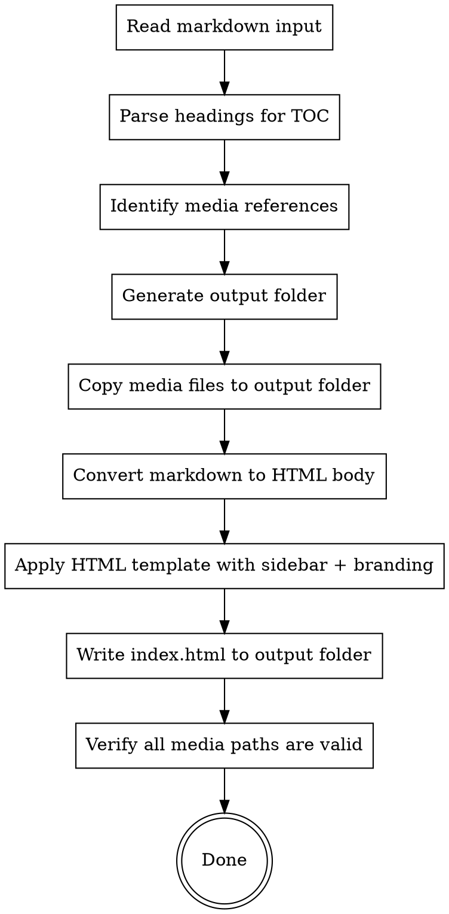
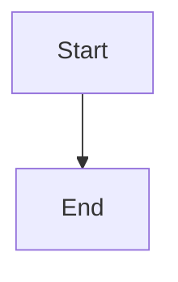

# Generating HTML Manual

## Overview

Convert a Markdown user manual into a self-contained, styled HTML page with sidebar catalogue navigation, back-to-top button, and company branding. Output is a folder containing the HTML file plus all referenced media assets.

## When to Use

- User provides a Markdown user manual (`.md` file) and wants an HTML version
- User asks to "convert manual to HTML", "generate HTML manual", "转HTML", "生成HTML手册"
- Default language: **Simplified Chinese** unless user specifies otherwise

## Prerequisites

1. **Markdown user manual** — the `.md` file to convert
2. **Media files** — any images or assets referenced in the markdown (relative paths)

**REQUIRED REFERENCES:**
- Read `color-spec.md` in this skill's directory for the complete color system and design tokens.
- Read `company_style/` in this skill's directory for logo assets.

## Workflow



### Step 1: Read and Parse

1. Read the input markdown file
2. Parse all headings (`##` and `###`) to build the sidebar TOC
3. Scan for media references: ``, ``, `[text](path.pdf)` etc.
4. Scan for mermaid/fenced diagram blocks: ```` ```mermaid ```` code blocks
5. Record the relative paths of all referenced media files

### Step 2: Create Output Folder

1. Create a new folder next to the input markdown file, named `{manual-name}-html/`
2. Create `media/` subfolder inside it for copied assets
3. Copy all referenced media files from their original locations to `media/`
4. Copy the company logo files from this skill's `company_style/` directory to `media/`

### Step 3: Convert Markdown to HTML

Convert the markdown content to well-structured HTML following these rules:

| Markdown | HTML Output |
|----------|------------|
| `## Heading` | `<h2>` with `id` attribute (slug) |
| `### Heading` | `<h3>` with `id` attribute (slug) |
| `**bold**` | `<strong>bold</strong>` |
| `> **note**: text` | `<blockquote>` with `.callout-tip` class |
| `> **warning**: text` | `<blockquote>` with `.callout-warning` class |
| `` | `<figure><figcaption>` structure, `max-width` capped at fixed value |
| `【图X：...】` | `<figure>` with `.screenshot-placeholder` class; placeholder text rendered as small caption **below** the image |
| Tables | Standard `<table>` with `<thead>` and `<tbody>` |
| `1. item` | `<ol><li>item</li></ol>` |
| `- item` | `<ul><li>item</li></ul>` |
| `` `code` `` | `<code>code</code>` |
| Code blocks | `<pre><code>...</code></pre>` |
| ````mermaid` blocks | `<pre class="mermaid">` — render as live diagrams, NOT raw code |

**Skip inline TOC sections:** If the markdown contains a "目录"、"Table of Contents"、"内容提要" or similar TOC section (a heading followed by a list of internal links), **omit it from the HTML body**. The sidebar already provides navigation — duplicating the TOC in the content area wastes space and confuses readers.

**Skip screenshot index table:** If the markdown ends with a screenshot index table (a section titled "截图索引"、"截图索引表"、"Screenshot Index" or similar, containing a table that maps screenshot placeholders to file paths), **omit this entire section from the HTML output**. This table is a build-time reference for tracking which screenshots exist — it is not end-user content and does not belong in the published manual.

**Heading ID slugs:** Generate from heading text — lowercase, replace spaces/special chars with hyphens, ensure uniqueness by appending `-2`, `-3` etc. for duplicates.

**Media path rewrite:** All media references in the HTML must point to `media/` relative path.

**Screenshot image sizing:** All screenshot images (`` inside `<figure>`) must have a fixed height: `height: 450px; object-fit: contain; object-position: center; max-width: 600px; width: 100%`. This ensures the browser reserves exactly 450px of vertical space **before** images load, preventing anchor scroll positions from drifting when lazy-loaded images arrive. The `object-fit: contain` preserves aspect ratio without distortion. **Also add explicit `width` and `height` HTML attributes** to each `` tag (obtain actual pixel dimensions via `sips` or similar tool) so the browser can compute the intrinsic aspect ratio even before CSS is applied.

**Image placeholder captions:** Placeholder text like `【图X：...】` describes what the image should contain. Render this text as a small caption (`<figcaption>`) **below** the image/placeholder, styled in a smaller font size (`0.85em`) and muted color (`var(--neutral-400)`). The placeholder text is an annotation, not a heading.

**Button icon descriptions:** If the markdown contains "按钮图标说明" sections (blockquotes with a list of icon names and corresponding `<figure>` elements), convert them to clean **tables** with two columns: 图标 (icon image) and 名称 (name). Use `` for the icon column, with CSS `height: 1.3em; width: auto` so icons render at text-line height. This is far more readable than the original blockquote+list+figure format. Example table structure:
```html
<p><strong>按钮图标说明</strong></p>
<table>
  <thead><tr><th>图标</th><th>名称</th></tr></thead>
  <tbody>
    <tr><td></td><td>名称</td></tr>
  </tbody>
</table>
```

### Step 4: Apply HTML Template

Generate a complete standalone HTML page with the following structure and design specs. All styles and scripts must be inline — single `index.html` output, with the exception of the Mermaid.js CDN script (see Mermaid & Flowchart Handling section).

#### Page Structure

- **Header** — fixed top bar with company logo, page title, version string, and mobile sidebar toggle
- **Sidebar** — fixed left navigation with TOC. Collapsible on all screen sizes via toggle button (desktop: shrink to 0 with slide animation; mobile: overlay mode). Collapse state persisted in `localStorage`.
- **Content** — main body area with max-width 900px, centered
- **Footer** — company logo and copyright
- **Back-to-top button** — fixed bottom-right, appears on scroll

#### Template Placeholders

| Placeholder | Source |
|-------------|--------|
| `{{TITLE}}` | First `#` heading or filename |
| `{{VERSION}}` | Version string if found (e.g., "V2.3.0"), otherwise empty |
| `{{CONTENT}}` | Converted HTML body from Step 3 |
| `{{TOC}}` | Generated sidebar TOC from headings |

#### Layout Specs

| Element | Spec |
|---------|------|
| Header height | 64px, fixed top, `z-index: 1000` |
| Sidebar width | 280px, fixed left, `z-index: 900` |
| Sidebar collapsed | Width 0 (hidden), content area expands to full width. Transition: `width 0.3s ease` |
| Sidebar toggle button | Always visible button (☰/✕ icon) in header or sidebar edge. On desktop: slides sidebar in/out. On mobile: overlay mode. |
| Sidebar state persistence | Save collapsed/expanded state to `localStorage` key `sidebar-collapsed`. Restore on page load. |
| Content max-width | 900px, centered. When sidebar collapsed: `margin-left: 0`, content centers in full viewport |
| Anchor scroll offset | CSS: `scroll-margin-top: 80px` on all `h2`/`h3`. JS: intercept TOC link clicks, call `scrollIntoView()` with manual offset for the 64px header + 16px breathing room |
| Back-to-top trigger | Scroll > 400px |
| Mobile breakpoint | ≤1024px: sidebar overlay mode (fixed position, full-height, shadow backdrop), toggle in header |
| Print | Hide header, sidebar, back-to-top; full-width content |

#### Contrast & Readability Rules

**NEVER use dark text (black, `#000`, `#1a1a2e`, `var(--neutral-900)`) on dark backgrounds.** Any element with a dark or deeply colored background must use light-colored text:

| Background type | Text color |
|----------------|------------|
| Hero gradient (`var(--gradient-hero)`) | `#ffffff` white |
| Table thead gradient (`var(--gradient-table)`) | `#ffffff` white |
| Code blocks (`#1e1e2e`) | `#cdd6f4` (light) |
| Any dark-colored section/div | `#ffffff` white or `var(--primary-200)` |
| CTA buttons (orange gradient) | `#ffffff` white |

**Header and footer bars:** Must use a light/white background because the horizontal company logo has **black text** and would be invisible on dark surfaces.

#### Responsive Behavior

- **Desktop (>1024px):** Sidebar visible by default (280px), content offset. Sidebar collapsible via toggle button — when collapsed, sidebar slides to 0 width, content expands to full viewport width centered.
- **Tablet/Mobile (≤1024px):** Sidebar hidden by default, hamburger toggle in header, overlay mode when open (full-height, shadow backdrop, closes on backdrop click or nav link click).
- **Small mobile (≤640px):** Reduced heading font sizes. Overlay sidebar takes full width.

#### Sidebar Collapse Behavior

The sidebar must support collapsing on ALL screen sizes, not just mobile:

1. **Toggle button:** A button (☰ hamburger icon) is always visible — on desktop it's at the sidebar edge or in the header; on mobile it's in the header.
2. **Desktop collapse:** Clicking toggle slides the sidebar out of view (width 0). The main content area's `margin-left` transitions from 280px to 0. The content re-centers in the full viewport.
3. **State persistence:** Use `localStorage` to remember collapsed state across page loads. Key: `sidebar-collapsed`, value: `"true"` or `"false"`.
4. **CSS transition:** `transition: width 0.3s ease` on sidebar, matching `transition: margin-left 0.3s ease` on content area.
5. **Collapsed indicator:** When sidebar is collapsed, show a subtle vertical tab/button at the left edge of the screen to expand it back (or use the header toggle button).
6. **Mobile:** Same toggle button switches to overlay mode (sidebar overlays content with dark backdrop) instead of push mode.

#### Anchor Scroll Behavior

TOC link clicks must scroll to the target heading with proper offset to prevent the fixed header from obscuring content:

1. **CSS fallback:** Add `scroll-margin-top: 80px` on all `h2` and `h3` elements. This handles browser-native anchor navigation (`#fragment` in URL).
2. **JavaScript interception:** Attach click handlers to all sidebar TOC links (`<a>` inside `.toc-list`). Prevent default, then:
   - Find the target element by `id` (extracted from `href` attribute)
   - Calculate scroll position: `target.getBoundingClientRect().top + window.pageYOffset - headerHeight - 16`
   - Use `window.scrollTo({ top: position, behavior: 'smooth' })`
   - The offset must account for: 64px header + 16px breathing room = 80px total
3. **Edge cases:**
   - Target element doesn't exist → silently ignore (don't throw)
   - Already at target → no scroll needed
   - Mobile overlay mode → close sidebar overlay after click
4. **Back-to-top button:** Use the same smooth scroll approach: `window.scrollTo({ top: 0, behavior: 'smooth' })`

### Step 5: Verify

After writing `index.html`:
1. Check all `src="media/..."` references point to files that exist in the output folder
2. If any media files are missing, warn the user with the list of missing files
3. Report the output folder path to the user

## TOC Generation

Build the sidebar TOC from parsed headings:

**Rules:**
- Include only `h2` and `h3` headings in the TOC
- Skip `h1` (it's the title in the header) and `h4+` (too deep for sidebar)
- Use `.toc-h2` class for `##` headings, `.toc-h3` class for `###` headings
- Generate URL-friendly slugs: lowercase, Chinese characters kept as-is, spaces to `-`, remove punctuation
- Each TOC item is an `<li>` containing an `<a>` linking to the heading's `id`

## Callout Conversion

Convert markdown blockquotes with specific markers to styled callouts:

| Blockquote starts with | CSS class |
|------------------------|-----------|
| `> **说明**：` or `> **提示**：` or `> **Tip**:` | `.callout-tip` |
| `> **注意**：` or `> **Warning**:` | `.callout-warning` |
| `> **危险**：` or `> **Danger**:` | `.callout-danger` |
| Regular blockquote (no marker) | Default blockquote (blue-gray) |

## Mermaid & Flowchart Handling

**CRITICAL: Never output raw Mermaid code in the HTML.** All mermaid/fenced diagram code blocks must be rendered as live interactive diagrams.

### Detection

Scan the markdown for fenced code blocks with the `mermaid` language tag:

````markdown

````

### Conversion

1. Convert each ```` ```mermaid ```` block to `<pre class="mermaid">` containing **only the Mermaid DSL** (no markdown fences)
2. Do NOT wrap in `<code>` — the Mermaid library targets `<pre class="mermaid">` directly
3. Include the Mermaid.js library via CDN in the HTML `<head>`:
   ```html
   <script src="https://cdn.jsdelivr.net/npm/mermaid@10/dist/mermaid.min.js"></script>
   ```
4. Initialize Mermaid at the end of the `<body>`, after all content:
   ```html
   <script>
   mermaid.initialize({ startOnLoad: true, theme: 'default' });
   </script>
   ```

### Styling

- Set `max-width: 100%` on `.mermaid` SVG output to prevent overflow on mobile
- Give `<pre class="mermaid">` a **fixed height** matching screenshot images: `height: 450px; overflow: auto; display: block`. Use `display: block` (NOT `display: flex`) — flex centering clips the top of tall diagrams even with scrollbars
- Add a subtle border and background to the `<pre class="mermaid">` container so it's visually distinct
- Mermaid text color defaults should remain readable against the page background

### Example

| Markdown Input | HTML Output |
|---------------|-------------|
| ```` ```mermaid\ngraph LR\n  A --> B\n```` ``` | `<pre class="mermaid">graph LR\n  A --> B\n</pre>` |

## Media Handling

**Image references:**
1. Find all `` in the markdown
2. Resolve relative paths from the markdown file's location
3. Copy each image to `{output}/media/{filename}`
4. Rewrite the `` to `media/{filename}` in HTML

**Non-image files (PDFs, docs):**

1. Same copy-to-media process
2. Rewrite link `href` to `media/{filename}`

**Company logos:**
- Always copy all files from `company_style/` to `{output}/media/`
- Header uses `研知教育科技_horizontal_logo.png`
- Footer uses `研知教育科技_horizontal_logo_widemargin.png`
- Circle logo available for favicon if desired
- **Horizontal logos have black text — NEVER place them on dark backgrounds.** The header and footer bars must use a light/white background (`#ffffff` or `var(--neutral-100)`) to keep logo text legible

## Language Default

- Always use `lang="zh-CN"` on `<html>` tag
- UI text in Chinese: "目录" (TOC), "返回顶部" (Back to top)
- Footer copyright in Chinese
- If user specifies a different language, adapt UI text accordingly

## Output Structure

```
{manual-name}-html/
├── index.html          # Complete standalone HTML
└── media/
    ├── 图1-登录页面.png
    ├── 图2-首页概览.png
    ├── 研知教育科技_horizontal_logo.png
    ├── 研知教育科技_horizontal_logo_widemargin.png
    └── 研知教育科技_white_circle_background.png
```

## Common Mistakes

| Mistake | Fix |
|---------|-----|
| Using external CSS/JS files | All styles and scripts must be inline — single `index.html` |
| Absolute paths for media | Always use relative `media/` paths |
| Missing heading IDs | Every heading needs an `id` for TOC linking |
| Forgetting to copy logos | Always copy all `company_style/` files |
| Hardcoded sidebar visible on mobile | Use responsive CSS + JS toggle |
| Not handling duplicate heading text | Append `-2`, `-3` etc. to duplicate slugs |
| Using non-Chinese UI text | Default to Simplified Chinese for all chrome text |
| Overwriting original markdown | Output to a new folder, never modify the source |
| Large images not optimized | Consider warning user if images exceed 2MB |
| Missing print styles | Include `@media print` to hide navigation elements |
| Horizontal logo on dark background | Logo text is black — header/footer must be white/light |
| Screenshot images too large | Set `max-width: 600px` on all `<figure>` images |
| Placeholder text above image | Place `【图X：...】` caption below image as `<figcaption>` |
| Dark text on dark background | Use white/light text on any dark-colored element |
| TOC section duplicated in body | Sidebar already shows TOC — omit "目录" sections from content |
| Screenshot index table included in HTML | Omit "截图索引" section entirely — it's a build-time reference, not end-user content |
| Outputting raw Mermaid code in HTML | Convert ```` ```mermaid ```` blocks to `<pre class="mermaid">` with CDN + initialization |
| Button icon descriptions as messy blockquotes | Convert "按钮图标说明" to clean 2-column tables (图标 \| 名称) with `.icon-inline` class |
| Anchor scroll hidden behind fixed header | Add `scroll-margin-top: 80px` to all `h2` and `h3` headings |
| Lazy images shift anchor scroll position | Give screenshot `` explicit `width`/`height` attrs + CSS `height: 450px; object-fit: contain` |
| Mermaid diagram different height than screenshots | Give `<pre class="mermaid">` `height: 450px` to match screenshot height |
| Mermaid diagram top clipped with flex | Use `display: block` (NOT `display: flex`) on `<pre class="mermaid">` to avoid overflow clipping |
| Sidebar not collapsible on desktop | Add toggle button with CSS width transition + JS toggle + localStorage persistence |
| Sidebar collapse state lost on reload | Save state to `localStorage.getItem/setItem('sidebar-collapsed')`, restore on DOMContentLoaded |
| Fixed header covers anchor target on TOC click | Intercept TOC link clicks with JS, use `window.scrollTo()` with manual offset (header 64px + 16px padding) |
| Anchor offset only uses CSS scroll-margin-top | CSS-only approach doesn't handle dynamic header height changes — add JS interception as primary method, CSS as fallback |
