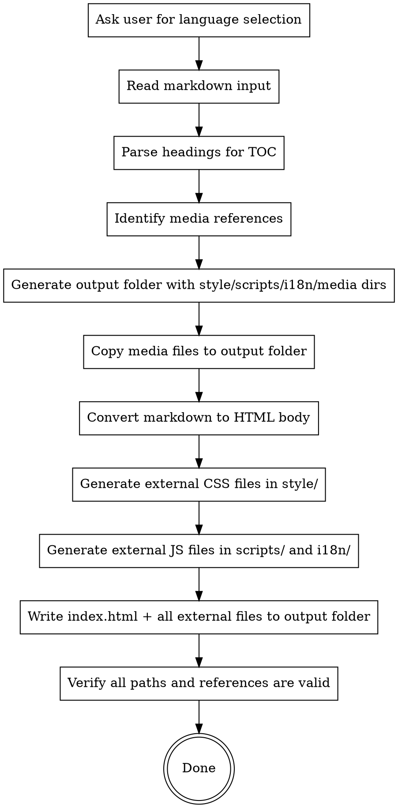
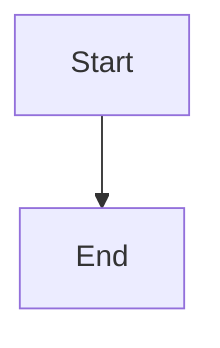

# Generating HTML Manual

## Overview

Convert a Markdown user manual into a styled HTML page with sidebar catalogue navigation, back-to-top button, and company branding. `index.html` contains only page layout (header, sidebar shell, content container, footer). All manual content text is stored in external JS files and injected at runtime — keeping `index.html` lean regardless of document size.

## When to Use

- User provides a Markdown user manual (`.md` file) and wants an HTML version
- User asks to "convert manual to HTML", "generate HTML manual", "转HTML", "生成HTML手册"
- Before generating HTML, you MUST ask the user to select languages (Step 0). Default: Simplified Chinese only if the user confirms it.

## Prerequisites

1. **Markdown user manual** — the `.md` file to convert
2. **Media files** — any images or assets referenced in the markdown (relative paths)

**REQUIRED REFERENCES:**
- Read `color-spec.md` in this skill's directory for the complete color system and design tokens.
- Read `company_style/` in this skill's directory for logo assets.

**DEVELOPMENT METHODOLOGY — TDD Required (RED-GREEN-REFACTOR):**

This skill generates an HTML page with external CSS/JS/i18n files. Content text is injected at runtime from JS files. **HTML/CSS/JS code generation (Steps 3-4) MUST follow the superpowers TDD cycle:**

1. **RED — Write failing tests first:** Before writing ANY HTML/CSS/JS code, write test assertions for each structure, style, and behavior. Tests must verify:
   - Correct heading hierarchy and ID slugs (anchor IDs are **always** lowercase English words with hyphen separators, regardless of content language; Chinese/Russian/Japanese/Korean/Arabic titles are translated to English for anchors; NEVER use pinyin or transliteration — e.g., `system-settings-export-path`, not `xi-tong-she-zhi`)
   - TOC link targets resolve to valid heading IDs
   - Sidebar toggle is a **pure icon button** (☰, no visible text) positioned left of the logo in the header
   - Back-to-top button is a **pure icon** (↑ or ▲, no visible text), fixed bottom-right; hidden at top, visible after scroll > 400px
   - Anchor scroll offset prevents fixed header from hiding targets
   - Contrast rules (no dark text on dark backgrounds)
   - Media path correctness (all `src`/`href` point to files that exist in `media/`)
   - All external file references resolve correctly (`style/*.css`, `scripts/*.js`, `i18n/*.js` — all relative paths from `index.html`)
   - Output directory contains all required subdirectories (`style/`, `scripts/`, `media/`) plus `i18n/` for multi-language
   - Print styles hide navigation chrome
   - URL `?lang=` parameter correctly sets language on page load (priority: URL > localStorage > default)
   - Combined `#anchor` + `?lang=` URL applies language first, then scrolls to anchor target
   - Anchor IDs never contain non-English characters (no pinyin, no Cyrillic, no Kanji, no Hangul, no Arabic script)
   - Language switcher click updates URL `?lang=` parameter without full page reload (`history.replaceState`)
   - `index.html` contains ONLY page layout (header, sidebar shell, content/toc containers, footer) — NO hardcoded manual content text
   - `i18n/content-{lang}.js` files exist for each language (e.g., `i18n/content-zh.js`, `i18n/content-en.js`) — each exports `I18N_CONTENT['{lang}']` with `body` and `toc` HTML strings
   - `switchLanguage()` injects `I18N_CONTENT[lang].body` into `#content-container` and `I18N_CONTENT[lang].toc` into `#toc-container` via `innerHTML`
   - `switchLanguage()` re-binds TOC link click handlers after injecting new TOC HTML
   - `switchLanguage()` calls `mermaid.run()` on the newly injected content to render diagrams
   - `switchLanguage()` swaps image `src` for header/footer logos using `data-src-{lang}` attributes
   - Images in injected content use `media/{lang}/` paths — no `data-src-{lang}` needed
   - `scripts/main.js` initializes `const I18N = {};` and `const I18N_CONTENT = {};` before any i18n files
   - Sidebar toggle button has NO `data-i18n` attribute and NO translatable text (pure icon)
   - Back-to-top button has NO `data-i18n` attribute and NO translatable text (pure icon)
   - All UI chrome text has `data-i18n` with translations (header-title, toc-title, footer-copyright, lang-switcher-label)
   - Header title bar text switches on language change — `<span data-i18n="header-title">` in the header with translations in every `i18n/{lang}.js` file
   - No `fold-sidebar`, `expand-sidebar`, or `back-to-top` keys exist in any i18n file
   - Default language content file is generated FIRST; other languages reuse the same anchor IDs by positional mapping
   - Anchor IDs are byte-for-byte identical across ALL language content files (not just semantically similar)
   - Single-language pages output content directly in `index.html` — no JS injection needed
2. **GREEN — Write minimal code to pass:** Generate the HTML body, create external CSS/JS/i18n files, wire up interactivity — one test at a time. Each increment of HTML/CSS/JS must correspond to a test that was already written and seen to fail.
3. **REFACTOR — Improve while keeping tests green:** Deduplicate styles, optimize selectors, streamline event handlers, improve semantic markup. Never add new behavior during refactoring.

**REQUIRED SUB-SKILL:** Use `superpowers:test-driven-development` to guide this process — it defines the RED-GREEN-REFACTOR discipline and rationalization countermeasures that keep TDD honest.

**Fallback:** If `superpowers:test-driven-development` is not available, still follow the TDD cycle described above. Do NOT skip testing because the skill is unavailable.

**Iron Law:** No HTML code before its corresponding test exists. Code written before tests → delete it and start over. No exceptions.

## Workflow



### Step 0: Language Selection (MANDATORY)

**Before any HTML generation begins**, you MUST ask the user which languages the HTML manual should support. Present these options:

1. **仅支持简体中文** (Only Simplified Chinese)
2. **支持简体中文、英文、俄语** (Simplified Chinese, English, Russian)
3. **自定义语言** (Custom — user specifies which languages to support)

Save the user's choice as the `LANGS` variable. Format: **comma-separated language codes** (no spaces between items).

| Choice | `LANGS` value |
|--------|---------------|
| 1 (仅中文) | `zh` |
| 2 (中英俄) | `zh,en,ru` |
| 3 (自定义) | User-specified codes, e.g., `zh,ja,ko` or `en,zh` |

Supported language codes: `zh` (Simplified Chinese), `en` (English), `ru` (Russian), `ja` (Japanese), `ko` (Korean), `fr` (French), `de` (German), `es` (Spanish), `pt` (Portuguese), `ar` (Arabic).

**If `LANGS` contains more than one language** (i.e., the string contains a comma), the HTML page MUST include full multi-language switching support. See the [Multi-Language Support](#multi-language-support) section for implementation details.

**If `LANGS` has only one language** (e.g., `zh`), skip all i18n — generate a single-language page as before. The single language becomes the page language and all UI chrome uses that language.

### Step 1: Read and Parse

1. Read the input markdown file
2. Parse all headings (`##` and `###`) to build the sidebar TOC
3. **Detect and strip the `anchor` fenced code block** (```` ```anchor ... ``` ````) — this is git metadata, not user-facing content. Record its presence but exclude it from the HTML body.
4. Scan for media references: ``, ``, `[text](path.pdf)` etc.
5. Scan for mermaid/fenced diagram blocks: ```` ```mermaid ```` code blocks
6. Record the relative paths of all referenced media files

### Step 2: Create Output Folder

1. Create a new folder next to the input markdown file, named `{manual-name}-html/`
2. Create the directory structure:
   - `style/` — external CSS stylesheets (one or more `.css` files)
   - `scripts/` — external JavaScript files (one or more `.js` files for page logic)
   - `i18n/` — language files (multi-language only). Two types: UI chrome (`{lang}.js`) and content (`content-{lang}.js`). Skip for single-language pages.
   - `media/` — media assets with language subfolder structure:
     - **Single-language** (`LANGS` has 1 item, e.g., `zh`): Create one `media/` subfolder
     - **Multi-language** (`LANGS` has >1 item, e.g., `zh,en,ru`): Create `media/{lang}/` subfolder for **each** language in `LANGS` (e.g., `media/zh/`, `media/en/`, `media/ru/`)
3. Copy all referenced media files (screenshots, diagrams, etc.):
   - **Single-language:** Copy to `media/` directly
   - **Multi-language:** Copy each media file to **ALL** language subfolders (e.g., `1-login.png` → `media/zh/1-login.png` + `media/en/1-login.png` + `media/ru/1-login.png`). Screenshots are identical across languages — this isolation ensures each language has its own complete media set.
4. Copy the company logo files from this skill's `company_style/` directory:
   - **Single-language:** Copy to `media/`
   - **Multi-language:** Copy to **ALL** language subfolders (e.g., `media/zh/`, `media/en/`, `media/ru/`)

### Step 3: Translate and Convert Markdown to HTML

**Multi-language: Sequential generation with shared anchor IDs.** When `LANGS` has multiple languages, content files MUST be generated in a specific order to guarantee identical anchor IDs across all languages:

**CRITICAL — Two-phase generation for anchor ID consistency:**

**Phase A: Generate default language first.** Convert the default language (first in `LANGS`) to HTML first. This establishes the **canonical anchor IDs and TOC structure** that all other languages must match:

1. Parse the source markdown into semantic blocks
2. Assign English anchor IDs to every heading (see Heading ID slugs rules below)
3. Generate the body HTML and TOC HTML
4. Save as `i18n/content-{DEFAULT_LANG}.js`
5. **Extract the anchor ID map** — a list of `{heading_level, heading_text, anchor_id}` tuples that records every heading's assigned anchor ID

**Phase B: Generate other languages, reusing anchor IDs.** For every remaining language in `LANGS`:

1. Translate the markdown content (headings, paragraphs, tables, callouts, figure captions, mermaid labels) to the target language
2. **For each heading, look up its anchor ID from Phase A's anchor ID map by heading position/index** — do NOT generate new anchor IDs independently. The mapping is positional: the 1st `h2` in the default language maps to the 1st `h2` in the target language, the 2nd `h3` maps to the 2nd `h3`, etc.
3. Generate the body HTML using the **same anchor IDs as the default language**, with only the visible heading text translated
4. Generate the TOC HTML using the **same anchor IDs and TOC structure** as the default language, with only the link text translated
5. Save as `i18n/content-{LANG}.js`

**Why this order matters:** If each language is translated independently, the AI may generate different English anchor IDs for the same heading (e.g., "系统设置" → `system-settings` in zh but `system-config` in en). Sequential generation with the default language as the authority prevents this divergence. Anchor IDs must be **byte-for-byte identical** across all language content files — not just semantically similar.

**Translation rules for each block:**
   - Headings: translate visible text, **keep anchor `id` from Phase A map** (do not regenerate)
   - Paragraphs, table cells, callout text: translate fully
   - Screenshot captions (`<figcaption>`): translate, keeping captions concise (≤10 chars after prefix)
   - Image `alt` text: translate
   - Code blocks: do NOT translate (code is language-neutral)
   - Mermaid diagram node labels: translate if they contain human-readable text. Each language's content file has its own `<pre class="mermaid">` with translated DSL
   - Do NOT translate: file paths, URLs, version strings, technical identifiers
   - The TOC HTML structure (heading hierarchy, nesting, class names) must match the default language byte-for-byte — only the visible link text changes

**Single-language:** Skip translation. Convert the markdown directly to HTML following the rules below. Place body content directly in `#content-container` and TOC directly in `#toc-container` in `index.html`. No JS injection needed.

**HTML conversion rules (apply per-language for multi-lang, once for single-lang):**

| Markdown | HTML Output |
|----------|------------|
| `## Heading` | `<h2>` with `id` attribute (slug) |
| `### Heading` | `<h3>` with `id` attribute (slug) |
| `**bold**` | `<strong>bold</strong>` |
| `> **note**: text` | `<blockquote>` with `.callout-tip` class |
| `> **warning**: text` | `<blockquote>` with `.callout-warning` class |
| `` | `<figure><figcaption>` structure, `max-width` capped at 720px |
| `【图X：...】` | `<figure>` with `.screenshot-placeholder` class; placeholder text rendered as small caption **below** the image |
| Tables | Standard `<table>` with `<thead>` and `<tbody>` |
| `1. item` | `<ol><li>item</li></ol>` |
| `- item` | `<ul><li>item</li></ul>` |
| `` `code` `` | `<code>code</code>` |
| Code blocks | `<pre><code>...</code></pre>` |
| ````mermaid` blocks | `<pre class="mermaid">` — render as live diagrams, NOT raw code |

**Skip anchor code block:** The markdown may contain an `anchor` fenced code block at the very beginning of the file (before the title), recording git branch/commit info:

````markdown
```anchor
branch: main
commit: abc123...
message: feat: ...
```
````

**Strip this block entirely from the HTML output.** It is machine-readable metadata for version tracking, not user-facing content. Parse it in Step 1 to detect its presence, then exclude it from the HTML body in Step 3.

**Skip inline TOC sections:** If the markdown contains a "目录"、"Table of Contents"、"内容提要" or similar TOC section (a heading followed by a list of internal links), **omit it from the HTML body**. The sidebar already provides navigation — duplicating the TOC in the content area wastes space and confuses readers.

**Skip screenshot index table:** If the markdown ends with a screenshot index table (a section titled "截图索引"、"截图索引表"、"Screenshot Index" or similar, containing a table that maps screenshot placeholders to file paths), **omit this entire section from the HTML output**. This table is a build-time reference for tracking which screenshots exist — it is not end-user content and does not belong in the published manual.

**Heading ID slugs (锚点名称格式 — CRITICAL, LANGUAGE-INDEPENDENT):** Generate anchor IDs as **lowercase English words separated by short dashes** (`-`), **regardless of the content language**. This is a hard rule: ALL heading text — whether in Chinese, Russian, Japanese, Korean, French, German, Spanish, Portuguese, Arabic, or any other language — must be **translated to English meaning** for anchor ID generation. Different levels of headings are also separated by short dashes.

- **NEVER use pinyin** — Chinese headings must be translated to actual English words (e.g., "系统设置" → `system-settings`, NOT `xi-tong-she-zhi`)
- **NEVER use transliteration** — Russian/Japanese/Korean/Arabic headings must be translated to English meaning (e.g., "Настройки" → `settings`, NOT `nastroiki`; "設定" → `settings`, NOT `settei`)
- **`h2` headings**: Translate the heading text to lowercase English, using hyphens between words. Examples: `login-page`, `faq`, `system-settings`, `user-management`
- **`h3` headings**: Use `parent-heading-current-heading` format (parent h2's English anchor - current h3's English text), all lowercase with hyphens. Examples: `system-settings-export-path`, `user-management-role-permissions`, `data-reports-access-logs`
- **`h4+` headings**: Continue chaining: `parent-grandparent-current-heading` format (e.g., `system-settings-security-password-policy`)
- **Do NOT include heading numbers** (like `1.1`, `2.3.1`, `01_`, `1、`, etc.) in anchor names — strip them entirely
- **Do NOT keep any non-English characters** in anchors — translate to English first, then convert to lowercase hyphenated form
- Replace spaces with hyphens; remove punctuation marks (colons `:`、`：`, brackets `（）`, quotation marks `""`、`「」`, periods `。`, commas `，`、`,`, slashes `/`)
- Ensure uniqueness by appending `-2`, `-3` etc. for duplicates

**Media path rewrite:** All media references must use relative paths:
- **Single-language:** `media/{filename}`
- **Multi-language (injected content):** Each language's content HTML uses its own path — `media/zh/{filename}` in `I18N_CONTENT['zh'].body`, `media/en/{filename}` in `I18N_CONTENT['en'].body`, etc.
- **Multi-language (header/footer logos in `index.html`):** Default to `media/{DEFAULT_LANG}/{filename}` and add `data-src-{lang}` attributes for runtime switching

**Screenshot image sizing:** All screenshot images (`` inside `<figure>`) must use a fixed height with wide aspect ratio (5:8 = height:width, matching 1200×1920px source screenshots): `height: 450px; object-fit: contain; object-position: center; max-width: 720px; width: 100%`. The `height: 450px` ensures the browser reserves exactly 450px of vertical space **before** images load, preventing anchor scroll positions from drifting when lazy-loaded images arrive. The `max-width: 720px` matches the 5:8 ratio (450 × 8/5 = 720), giving screenshots a landscape/widescreen display. The `object-fit: contain` preserves aspect ratio without distortion. **Also add explicit `width` and `height` HTML attributes** to each `` tag (obtain actual pixel dimensions via `sips` or similar tool) so the browser can compute the intrinsic aspect ratio even before CSS is applied.

**Image opacity — CRITICAL: All images must be fully opaque.** NEVER apply `opacity` CSS to any ``, `<figure>`, or image container element. Images (screenshots, diagrams, icons, logos) must always render at 100% opacity (`opacity: 1`). Specifically forbidden:
- `opacity: 0.X` or `opacity: X%` on ``, `<figure>`, or any parent that wraps images
- `transition: opacity` that animates images to semi-transparency
- `:hover { opacity: ... }` on images — hover effects on images must NOT change opacity
- Using opacity to create "grayed out" or "disabled" visual states on images
- Any CSS filter or blend mode that reduces image visibility

Rationale: Screenshots and diagrams are informational content, not decorative elements. Semi-transparent images degrade readability, reduce contrast, and make the manual look unprofessional. The page already has a clean design system — opacity tricks are unnecessary and harmful.

**Image placeholder captions:** Placeholder text like `【图X：...】` describes what the image should contain. Render this text as a small caption (`<figcaption>`) **below** the image/placeholder, styled in a smaller font size (`0.85em`) and muted color (`var(--neutral-400)`). The placeholder text is an annotation, not a heading.

**Screenshot description shortening (CRITICAL):** The original Markdown may contain lengthy screenshot descriptions (e.g., `【图1：登录页面全貌，展示渐变背景、公司Logo、玻璃质感登录卡片、用户名输入框、密码输入框、"登录"按钮的整体布局】`). When converting to HTML, **shorten every screenshot caption to 10 characters or fewer** (not counting the prefix `图X：`). The caption must be a concise label, not a detailed description:

| Original Markdown | HTML `<figcaption>` |
|---|---|
| `【图1：登录页面全貌，展示渐变背景、公司Logo、玻璃质感登录卡片】` | `图1：登录页面` |
| `【图2：首页概览，包含顶部导航栏、数据统计卡片、图表区域】` | `图2：首页概览` |
| `【图3：用户管理界面，展示用户列表、搜索框、新增按钮】` | `图3：用户管理` |

**Rule:** Extract only the core page/feature name (≤10 characters after `图X：`). Discard all descriptive detail — the screenshot itself shows what the text describes. The caption is a label, not a replacement for viewing the image.

**Button icon descriptions:** Detect sections that describe button/icon mappings based on two features occurring together in proximity: (1) text containing "图标说明" or "图标列表" or "icon reference", and (2) one or more image links (`` or ``) paired with icon names. When both features are detected, convert the section to a clean **table** with two columns: 图标 (icon image) and 名称 (name). Do NOT assume a specific markdown format (blockquote, list, paragraph, figure) — the detection is content-driven, not format-driven. Use `` for the icon column, with CSS `height: 1.3em; width: auto` so icons render at text-line height. Example table structure:
```html
<p><strong>按钮图标说明</strong></p>
<table>
  <thead><tr><th>图标</th><th>名称</th></tr></thead>
  <tbody>
    <tr><td></td><td>名称</td></tr>
  </tbody>
</table>
```

### Step 4: Apply HTML Template

Generate a complete HTML page with the following structure and design specs. Styles and scripts should be external files referenced via relative paths from `index.html`:

- **CSS files** go in `style/` directory (e.g., `style/main.css`, `style/components.css`)
- **JS files** go in `scripts/` directory (e.g., `scripts/main.js`)
- **i18n files** go in `i18n/` directory — two categories:
  - **UI chrome** (`i18n/{lang}.js`): `data-i18n` translations for toc-title, footer-copyright, lang-switcher-label
  - **Content** (`i18n/content-{lang}.js`): full body HTML and TOC HTML strings injected at runtime. One file per language.
- **Mermaid.js** is loaded via CDN in the HTML `<head>` (no local copy needed)
- **Company logo images** are referenced from `media/` (single-lang) or `media/{lang}/` (multi-lang)

All external files are referenced from `index.html` using relative paths (e.g., `<link rel="stylesheet" href="style/main.css">`, `<script src="scripts/main.js"></script>`, `<script src="i18n/zh.js"></script>`).

#### Page Structure

- **Header** — fixed top bar with menu toggle icon (☰) on the far left, followed by company logo, page title (`<span data-i18n="header-title">`), and version string. The menu icon toggles the sidebar fold/unfold. The page title text is translated via `data-i18n` — each language file provides its own `header-title` value. When multi-language is active (`LANGS` has >1 item), a **language switcher widget** sits in the **top-right corner** of the header.
- **Sidebar** — fixed left navigation. Defaults to visible (280px width). Contains a `<div id="toc-container">` populated by JS with the current language's TOC HTML. When folded, the content area expands.
- **Content** — main body area with max-width 900px, centered. Contains a `<div id="content-container">` populated by JS with the current language's body HTML. Has `margin-left: 280px` when sidebar is visible.
- **Footer** — company logo and copyright
- **Back-to-top button** — fixed bottom-right, appears on scroll. **Pure icon button** (↑ or ▲)

#### Template Placeholders

| Placeholder | Source |
|-------------|--------|
| `{{TITLE}}` | First `#` heading or filename |
| `{{VERSION}}` | Version string if found (e.g., "V2.3.0"), otherwise empty |
| `{{BODY_CONTENT}}` | **Single-language only:** Converted HTML body from Step 3, placed directly in `#content-container`. **Multi-language:** empty string — content is injected by JS from `i18n/content-{lang}.js` |
| `{{SIDEBAR_TOC}}` | **Single-language only:** Generated TOC `<ul>`, placed directly in `#toc-container`. **Multi-language:** empty string — TOC is injected by JS |
| `{{DEFAULT_LANG}}` | First language code from `LANGS` (e.g., `zh`) — used in JS init |
| `{{LANGS_LIST}}` | Full `LANGS` string (e.g., `zh,en,ru`) — used for language switcher |
| `{{UI_I18N_SCRIPTS}}` | `<script>` tags loading UI chrome i18n files (`i18n/zh.js`, `i18n/en.js`). Empty if single-language. |
| `{{CONTENT_SCRIPTS}}` | `<script>` tags loading content files (`i18n/content-zh.js`, `i18n/content-en.js`). Empty if single-language. |
| `{{LANG_SWITCHER}}` | HTML for language switcher button row (empty if single-language) |

#### Layout Specs

| Element | Spec |
|---------|------|
| Header height | 64px, fixed top, `z-index: 1000`. Contains menu toggle **icon button** (☰, no text) on the far left, then logo, title, version. The icon button uses only the ☰ Unicode character (or equivalent SVG icon) with no visible text label — it is a pure icon. When multi-language: language switcher buttons at the far right. |
| Sidebar width | 280px, fixed left, `z-index: 900`. Defaults to visible. Toggled by the header menu icon. TOC list items MUST have `list-style: none` (no bullet points). Use CSS `transition` on `transform` or `margin-left` for smooth fold/unfold animation. |
| Content max-width | 900px, centered. Content area has `margin-left: 280px` when sidebar is visible; transitions to `margin-left: 0` (or auto-centered) when sidebar is folded. |
| Anchor scroll offset | CSS: `scroll-margin-top: 80px` on all `h2`/`h3`. JS: intercept TOC link clicks, call `scrollIntoView()` with manual offset for the 64px header + 16px breathing room |
| Back-to-top trigger | Scroll > 400px |
| Print | Hide header, sidebar, back-to-top; full-width content |

#### Contrast & Readability Rules

**NEVER use dark text (black, `#000`, `#1a1a2e`, `var(--neutral-900)`) on dark backgrounds.** Any element with a dark or deeply colored background must use light-colored text:

| Background type | Text color |
|----------------|------------|
| Hero gradient (`var(--gradient-hero)`) | `#ffffff` white |
| Table thead gradient (`var(--gradient-table)`) | `#ffffff` white |
| Code blocks (`#1e1e2e`) | `#cdd6f4` (light) |
| Any dark-colored section/div | `#ffffff` white or `var(--primary-200)` |
| CTA buttons (orange gradient) | `#ffffff` white |

**Header and footer bars:** Must use a light/white background because the horizontal company logo has **black text** and would be invisible on dark surfaces.

#### Sidebar Toggle Behavior

The sidebar can be folded/unfolded via the menu icon button (☰) in the header:

1. **Menu icon button:** The ☰ icon (or equivalent hamburger icon SVG) is a **pure icon button with no visible text label**. It sits to the **left of the logo** in the header bar. It is always visible. The button may have an `aria-label` for accessibility (e.g., `aria-label="Toggle sidebar"`) but no visible text.
2. **Default state:** Sidebar visible (unfolded), 280px width. Content area has `margin-left: 280px`.
3. **Folded state:** Sidebar hidden. Content area expands to full width (centered via auto margins, max-width 900px).
4. **Toggle action:** Clicking the icon button toggles between folded and unfolded states. Use CSS transitions for smooth animation. The icon itself does NOT change (☰ stays ☰ in both states).
5. **localStorage persistence:** Persist the sidebar fold state in `localStorage` so the user's preference is remembered across page loads.
6. **TOC link clicks:** When a TOC link is clicked, scroll to the target heading with proper offset. Do NOT fold the sidebar on link click — the user controls sidebar state explicitly via the icon button.

#### Anchor Scroll Behavior

TOC link clicks must scroll to the target heading with proper offset to prevent the fixed header from obscuring content:

1. **CSS fallback:** Add `scroll-margin-top: 80px` on all `h2` and `h3` elements. This handles browser-native anchor navigation (`#fragment` in URL).
2. **JavaScript interception:** Attach click handlers to all sidebar TOC links (`<a>` inside `.toc-list`). Prevent default, then:
   - Find the target element by `id` (extracted from `href` attribute)
   - Calculate scroll position: `target.getBoundingClientRect().top + window.pageYOffset - headerHeight - 16`
   - Use `window.scrollTo({ top: position, behavior: 'smooth' })`
   - The offset must account for: 64px header + 16px breathing room = 80px total
3. **Edge cases:**
   - Target element doesn't exist → silently ignore (don't throw)
   - Already at target → no scroll needed
4. **Back-to-top button:** Use the same smooth scroll approach: `window.scrollTo({ top: 0, behavior: 'smooth' })`

### Step 5: Verify

After writing all output files:
1. Check all `src="media/..."` and `href="media/..."` references point to files that exist in the output folder
2. Check all external file references resolve correctly:
   - `<link rel="stylesheet" href="style/...">` → file exists in `style/`
   - `<script src="scripts/...">` → file exists in `scripts/`
   - `<script src="i18n/...">` → file exists in `i18n/` (multi-language only)
3. If any files are missing, warn the user with the list of missing files
4. Report the output folder path to the user

## TOC Generation

Build the sidebar TOC from parsed headings:

**Rules (all pages):**
- Include only `h2` and `h3` headings in the TOC
- Skip `h1` (it's the title in the header) and `h4+` (too deep for sidebar)
- Use `.toc-h2` class for `##` headings, `.toc-h3` class for `###` headings
- Generate anchor IDs: lowercase English words with hyphen separators, chain heading levels with hyphens. ALL heading text must be translated to English first. Never use pinyin or transliteration. See Heading ID slugs in Step 3 for full rules.
- Each TOC item is an `<li>` containing an `<a>` linking to the heading's `id`
- **CRITICAL — TOC must NOT show bullet points.** Add these CSS rules in `style/main.css`:
  ```css
  .toc-list { list-style: none; padding-left: 0; margin: 0; }
  .toc-list li { list-style: none; }
  ```
  Nested `<ul>` elements (for `h3` sub-items) also must not show bullets — the `.toc-list li` rule covers them via inheritance, but add `.toc-list ul { list-style: none; padding-left: 16px; }` for safe measure.

**Multi-language TOC:** Generate a separate TOC HTML string for each language. Each language's TOC uses identical anchor IDs but translated heading text. Save each TOC string as `I18N_CONTENT['{lang}'].toc` in the content file. At runtime, `switchLanguage()` injects the correct TOC HTML into `#toc-container`.

**Single-language TOC:** Output the TOC `<ul>` directly in `index.html` inside `#toc-container`. No JS injection needed.

**Example TOC injected by JS (multi-language):**

```html
<!-- Injected into #toc-container by switchLanguage('zh') -->
<ul class="toc-list">
  <li class="toc-h2"><a href="#system-settings">系统设置</a></li>
  <li class="toc-h3"><a href="#system-settings-export-path">导出路径</a></li>
</ul>

<!-- Injected into #toc-container by switchLanguage('en') -->
<ul class="toc-list">
  <li class="toc-h2"><a href="#system-settings">System Settings</a></li>
  <li class="toc-h3"><a href="#system-settings-export-path">Export Path</a></li>
</ul>
```

## Callout Conversion

Convert markdown blockquotes with specific markers to styled callouts:

| Blockquote starts with | CSS class |
|------------------------|-----------|
| `> **说明**：` or `> **提示**：` or `> **Tip**:` | `.callout-tip` |
| `> **注意**：` or `> **Warning**:` | `.callout-warning` |
| `> **危险**：` or `> **Danger**:` | `.callout-danger` |
| Regular blockquote (no marker) | Default blockquote (blue-gray) |

## Mermaid & Flowchart Handling

**CRITICAL: Never output raw Mermaid code in the HTML.** All mermaid/fenced diagram code blocks must be rendered as live interactive diagrams.

### Detection

Scan the markdown for fenced code blocks with the `mermaid` language tag:

````markdown

````

### Conversion

1. Convert each ```` ```mermaid ```` block to `<pre class="mermaid">` containing **only the Mermaid DSL** (no markdown fences)
2. Do NOT wrap in `<code>` — the Mermaid library targets `<pre class="mermaid">` directly
3. Include the Mermaid.js library via CDN in the HTML `<head>`:
   ```html
   <script src="https://cdn.jsdelivr.net/npm/mermaid@10/dist/mermaid.min.js"></script>
   ```
4. Initialize Mermaid. The approach depends on single-language vs multi-language:

   **CRITICAL — Mermaid.js CDN must load BEFORE `scripts/main.js`.** In `index.html` `<head>`:
   ```html
   <script src="https://cdn.jsdelivr.net/npm/mermaid@10/dist/mermaid.min.js"></script>
   <script src="scripts/main.js"></script>
   ```
   The CDN script is synchronous — `mermaid` global is available when `scripts/main.js` runs.

   **Single-language** (content is inline in `index.html`):
   ```javascript
   // In scripts/main.js:
   mermaid.initialize({ startOnLoad: true, theme: 'default' });
   // startOnLoad: true auto-renders all pre.mermaid elements on DOMContentLoaded
   ```

   **Multi-language** (content injected by JS at runtime):
   - `mermaid.initialize({ startOnLoad: false })` — no `<pre class="mermaid">` exists in `index.html` at load time
   - After `switchLanguage()` injects content HTML via `innerHTML`, call `mermaid.run()` on ALL `<pre class="mermaid">` elements in the newly injected content
   - Mermaid internally tracks which elements have been processed — calling `mermaid.run()` on already-rendered elements is safe (no-ops)
   - Since injected content is in a visible container, Mermaid measures correct dimensions — no `display:none` workaround needed
   - **Multi-language mermaid labels:** Each language's content file (`i18n/content-{lang}.js`) contains its own `<pre class="mermaid">` with **translated node labels** in the Mermaid DSL. When `switchLanguage()` replaces content and calls `mermaid.run()`, the new language's diagram renders with translated text.

   ```javascript
   // In scripts/main.js:
   mermaid.initialize({ startOnLoad: false, theme: 'default' });

   async function renderMermaidInContent() {
     const container = document.getElementById('content-container');
     if (!container) return;
     // Query ALL pre.mermaid — mermaid.run() internally skips already-processed ones
     const elements = container.querySelectorAll('pre.mermaid');
     if (elements.length > 0) {
       await mermaid.run({ nodes: Array.from(elements) });
     }
   }
   ```

   **Common Mermaid rendering failures and fixes:**
   - **Mermaid CDN loaded AFTER main.js** → Mermaid global undefined at init time. Fix: `<script src="CDN">` BEFORE `<script src="scripts/main.js">` in `<head>`
   - **`mermaid.run()` called before `innerHTML` DOM is ready** → elements exist but not yet laid out. Fix: call `mermaid.run()` synchronously after `innerHTML` — no `requestAnimationFrame` needed since `mermaid.run()` is async and awaits internal rendering
   - **Mermaid syntax errors in translated DSL** → non-English characters in node labels must use quotes: `A["中文标签"]`. Unquoted non-ASCII text causes parse failures
   - **Mermaid DSL contains special characters** → wrap labels in double quotes: `A["标签：设置"]`. Colons, parentheses, brackets in unquoted labels break the parser

### Styling

- Set `max-width: 100%` on `.mermaid` SVG output to prevent overflow on mobile
- Give `<pre class="mermaid">` a **fixed height** matching screenshot images: `height: 450px; overflow: auto; display: block`. Use `display: block` (NOT `display: flex`) — flex centering clips the top of tall diagrams even with scrollbars
- Add a subtle border and background to the `<pre class="mermaid">` container so it's visually distinct
- Mermaid text color defaults should remain readable against the page background

### Example

| Markdown Input | HTML Output |
|---------------|-------------|
| ```` ```mermaid\ngraph LR\n  A --> B\n```` ``` | `<pre class="mermaid">graph LR\n  A --> B\n</pre>` |

## Media Handling

**Image references:**
1. Find all `` in the markdown
2. Resolve relative paths from the markdown file's location
3. Copy each image to the appropriate media directories:
   - **Single-language:** `{output}/media/{filename}`
   - **Multi-language:** `{output}/media/{lang}/{filename}` for each language in `LANGS`
4. Rewrite the `` in HTML:
   - **Single-language:** `media/{filename}`
   - **Multi-language (injected content):** `media/{lang}/{filename}` — each language's content HTML string uses its own path
   - **Multi-language (header/footer logos in `index.html`):** `media/{DEFAULT_LANG}/{filename}` + `data-src-{lang}` attributes for runtime switching

**Non-image files (PDFs, docs):**

1. Same copy-to-media process (copy to all language subfolders for multi-language)
2. Rewrite link `href`:
   - **Single-language:** `media/{filename}`
   - **Multi-language (injected content):** `media/{lang}/{filename}` per language
   - **Multi-language (logos in `index.html`):** `media/{DEFAULT_LANG}/{filename}` + `data-href-{lang}` attributes

**Company logos:**
- Always copy all files from `company_style/` to the `media/` directory:
  - **Single-language:** `{output}/media/`
  - **Multi-language:** ALL language subfolders (`{output}/media/zh/`, `{output}/media/en/`, etc.)
- In HTML, reference logos from `media/` (single-lang) or `media/{DEFAULT_LANG}/` (multi-lang)
- Header uses `wisquest_horizontal_logo.png`
- Footer uses `wisquest_horizontal_logo_widemargin.png`
- Circle logo available for favicon if desired
- **Horizontal logos have black text — NEVER place them on dark backgrounds.** The header and footer bars must use a light/white background (`#ffffff` or `var(--neutral-100)`) to keep logo text legible

## Multi-Language Support

When `LANGS` contains more than one language (comma-separated), the generated HTML must include a full i18n (internationalization) system. When `LANGS` has only one language, skip all i18n — generate a single-language page directly in that language.

### LANGS Variable

`LANGS` is a comma-separated string of language codes. The **first language** in the list is the **default language** shown on first page load.

| `LANGS` | Languages | i18n Required? |
|---------|-----------|----------------|
| `zh` | Simplified Chinese only | ❌ No — single-language page |
| `zh,en,ru` | Chinese (default), English, Russian | ✅ Yes — full i18n |
| `en,zh,ja,ko` | English (default), Chinese, Japanese, Korean | ✅ Yes — full i18n |

### Language Switching Widget

When multi-language is active, add a language switcher in the **top-right corner of the header**:

- **Position:** Inside the header bar, right-aligned. Displayed to the right of the version string, before any other controls.
- **Appearance:** A row of compact language-code buttons (e.g., `ZH` `EN` `RU`). Each button has the `.lang-switch-btn` class. The active language button uses the accent color (`var(--accent-700)`) as background or border to distinguish it.
- **Interaction:** Clicking a button switches the page language immediately. Persist the choice in `localStorage` (key: `manual-lang`).
- **On page load:** Read `localStorage` for saved preference; fall back to the first language in `LANGS` (the default).
- **Style notes:** Buttons should be compact (`font-size: 0.75rem; padding: 2px 6px; border-radius: 3px`), with a subtle border (`1px solid var(--neutral-200)`). Active button gets `background: var(--accent-700); color: #fff; border-color: var(--accent-700)`.

### URL Language Parameter (`?lang=`)

The HTML page must support a `?lang=` URL query parameter to set the display language on page load. This allows linking directly to a specific language version (e.g., `manual.html?lang=en`).

**Priority (highest to lowest) on page load:**

1. **URL `?lang=` parameter** — highest priority; overrides everything else
2. **`localStorage` saved preference** (`manual-lang` key) — used when no URL param
3. **Default language** (first language in `LANGS`) — final fallback

**Behavior:**
- `?lang=zh` → display Chinese version (UI chrome + content blocks + images)
- `?lang=en` → display English version
- `?lang=ru` → display Russian version
- Unsupported/invalid language code → fall through to localStorage, then default
- No `?lang=` parameter → use localStorage, then default

**Combined `#` anchor + `?lang=` parameter:**

When the URL contains both a hash anchor and a language parameter (e.g., `manual.html?lang=zh#system-settings-export-path`), the page must:

1. **Apply language first** — read `?lang=` and `await switchLanguage()` to inject correct content HTML + UI chrome
2. **Then scroll to anchor** — after content is injected and Mermaid diagrams are rendered, scroll the target heading into view with proper offset (64px header + 16px padding = 80px)
3. Use `await` on `switchLanguage()` (it's async — waits for Mermaid rendering) + double `requestAnimationFrame` to defer anchor scroll
4. If the anchor target doesn't exist, silently do nothing

The implementation is in the `DOMContentLoaded` handler in [Language Switching Implementation](#language-switching-implementation) below — it `await`s `switchLanguage()`, then defers anchor scrolling.
	
	### data-i18n Attributes

All localizable UI chrome text must use `data-i18n` attributes. Each translatable element gets a unique key:

```html
<span data-i18n="header-title">用户使用手册</span>
<span data-i18n="toc-title">目录</span>
<p data-i18n="footer-copyright">© 2026 研知教育科技 版权所有</p>
```

The initial text content (before any JS runs) must be in the **default language** (first in `LANGS`). The i18n system replaces it on language switch.

**Note:** The sidebar toggle button (☰) and back-to-top button (↑) are pure icons with no visible text — they do NOT use `data-i18n` and have no translatable text. They may have `aria-label` attributes for screen readers but no visible labels.

### Translation Files (External i18n JS)

Translation text for UI chrome (data-i18n elements) is stored in **separate JavaScript files** under the `i18n/` directory — one file per language. Each file defines a `I18N[LANG]` object on the global `I18N` namespace:

**`i18n/zh.js`** (Chinese):
```javascript
I18N['zh'] = {
  'header-title': '用户使用手册',
  'toc-title': '目录',
  'footer-copyright': '© 2026 研知教育科技 版权所有',
  'lang-switcher-label': '语言'
};
```

**`i18n/en.js`** (English):
```javascript
I18N['en'] = {
  'header-title': 'User Manual',
  'toc-title': 'Contents',
  'footer-copyright': '© 2026 WisQuest EdTech. All rights reserved.',
  'lang-switcher-label': 'Language'
};
```

**`i18n/ru.js`** (Russian):
```javascript
I18N['ru'] = {
  'header-title': 'Руководство пользователя',
  'toc-title': 'Содержание',
  'footer-copyright': '© 2026 WisQuest EdTech. Все права защищены.',
  'lang-switcher-label': 'Язык'
};
```

**Key rules for i18n files:**
- Each file MUST define translations for ALL `data-i18n` keys used in the page
- Keys are identical across all language files (same set of `data-i18n` keys)
- The global `I18N` object is initialized in `scripts/main.js` before any i18n files are loaded: `const I18N = {};`
- i18n files are loaded AFTER `scripts/main.js` and BEFORE the `DOMContentLoaded` handler fires
- No `fold-sidebar` / `expand-sidebar` / `back-to-top` keys — sidebar toggle and back-to-top buttons are pure icons with no text
- The `index.html` `<head>` loads i18n files as: `<script src="i18n/zh.js"></script>` etc.

### Content Files (`i18n/content-{lang}.js`)

When `LANGS` has multiple languages, ALL manual content text (headings, paragraphs, tables, figures, callouts, code blocks) and sidebar TOC HTML are stored in content JS files — NOT in `index.html`. Each language gets its own content file.

**`i18n/content-zh.js`** (Chinese content):
```javascript
I18N_CONTENT['zh'] = {
  toc: '<ul class="toc-list">' +
    '<li class="toc-h2"><a href="#system-settings">系统设置</a></li>' +
    '<li class="toc-h3"><a href="#system-settings-export-path">导出路径</a></li>' +
    '</ul>',
  body: '<h2 id="system-settings">系统设置</h2>' +
    '<p>这是系统设置页面的详细说明...</p>' +
    '<figure>' +
    '' +
    '<figcaption>图1：系统设置</figcaption>' +
    '</figure>' +
    '<pre class="mermaid">graph LR\n  A[开始] --> B[结束]</pre>'
};
```

**Key rules for content files:**
- Each file defines `I18N_CONTENT['{lang}']` with two properties: `toc` (sidebar TOC HTML string) and `body` (full content HTML string)
- Content HTML follows ALL the same conversion rules as Step 3 (headings, figures, callouts, tables, Mermaid, etc.)
- Images use `media/{lang}/` paths — language-specific media
- Anchor IDs are identical across all language content files
- `I18N_CONTENT` global is initialized in `scripts/main.js` as `const I18N_CONTENT = {};`
- Content files are loaded AFTER `scripts/main.js` but BEFORE the `DOMContentLoaded` handler
- The `index.html` `<head>` loads content files as: `<script src="i18n/content-zh.js"></script>` etc.
- `index.html` itself contains ZERO manual content text — only layout shells with empty container divs
- **Single-language pages** skip content files entirely — content goes directly in `index.html`

### Language Switching Implementation

The page logic (`scripts/main.js`) initializes namespaces and handles language switching. All text content is injected at runtime — `index.html` contains only empty container divs.

**`scripts/main.js`** — core page logic:

```javascript
// Global namespaces (populated by external i18n files)
const I18N = {};
const I18N_CONTENT = {};

// Mermaid init (render after content is injected into visible containers)
mermaid.initialize({ startOnLoad: false, theme: 'default' });

async function renderMermaidInContent() {
  const container = document.getElementById('content-container');
  if (!container) return;
  const elements = container.querySelectorAll('pre.mermaid');
  if (elements.length > 0) {
    await mermaid.run({ nodes: Array.from(elements) });
  }
}

async function switchLanguage(lang) {
  if (!I18N[lang]) return;
  document.documentElement.lang = lang === 'zh' ? 'zh-CN' : lang;

  // 1. Switch UI chrome text (data-i18n)
  document.querySelectorAll('[data-i18n]').forEach(el => {
    const key = el.getAttribute('data-i18n');
    if (I18N[lang] && I18N[lang][key]) {
      el.textContent = I18N[lang][key];
    }
  });

  // 2. Inject content HTML into containers (replaces all previous content)
  if (I18N_CONTENT[lang]) {
    const contentEl = document.getElementById('content-container');
    const tocEl = document.getElementById('toc-container');
    if (contentEl) contentEl.innerHTML = I18N_CONTENT[lang].body;
    if (tocEl) tocEl.innerHTML = I18N_CONTENT[lang].toc;
  }

  // 3. Switch header/footer logo src (outside injected content)
  document.querySelectorAll('img[data-src-zh]').forEach(img => {
    const newSrc = img.getAttribute('data-src-' + lang);
    if (newSrc) img.src = newSrc;
  });

  // 4. Re-bind TOC link handlers (TOC HTML was replaced)
  initTocLinks();

  // 5. Render Mermaid diagrams in newly injected content (visible container, no display:none issue)
  await renderMermaidInContent();

  localStorage.setItem('manual-lang', lang);
  const url = new URL(window.location);
  url.searchParams.set('lang', lang);
  window.history.replaceState({}, '', url);
  document.querySelectorAll('.lang-switch-btn').forEach(btn => {
    btn.classList.toggle('active', btn.dataset.lang === lang);
  });
}

function getUrlLang() {
  const params = new URLSearchParams(window.location.search);
  return params.get('lang');
}

// Sidebar toggle (icon-only button, no text)
function initSidebarToggle() {
  const toggleBtn = document.getElementById('sidebar-toggle');
  const sidebar = document.getElementById('sidebar');
  const content = document.getElementById('content');
  if (!toggleBtn || !sidebar) return;
  const saved = localStorage.getItem('sidebar-folded');
  let folded = saved === 'true';
  function applyState() {
    sidebar.classList.toggle('folded', folded);
    content.classList.toggle('expanded', folded);
  }
  applyState();
  toggleBtn.addEventListener('click', () => {
    folded = !folded;
    localStorage.setItem('sidebar-folded', folded);
    applyState();
  });
}

// Back-to-top button (icon-only: ↑, no text)
function initBackToTop() {
  const btn = document.getElementById('back-to-top');
  if (!btn) return;
  window.addEventListener('scroll', () => {
    btn.style.display = window.scrollY > 400 ? '' : 'none';
  });
  btn.addEventListener('click', () => {
    window.scrollTo({ top: 0, behavior: 'smooth' });
  });
}

// TOC link click handling (re-bound after each language switch)
function initTocLinks() {
  document.querySelectorAll('.toc-list a[href^="#"]').forEach(link => {
    link.addEventListener('click', (e) => {
      e.preventDefault();
      const target = document.querySelector(link.getAttribute('href'));
      if (target) {
        const headerHeight = 64;
        const position = target.getBoundingClientRect().top + window.pageYOffset - headerHeight - 16;
        window.scrollTo({ top: position, behavior: 'smooth' });
      }
    });
  });
}

document.addEventListener('DOMContentLoaded', async () => {
  const urlLang = getUrlLang();
  const saved = localStorage.getItem('manual-lang');
  const defaultLang = '{{DEFAULT_LANG}}';

  const lang = (urlLang && I18N[urlLang]) ? urlLang
    : (saved && I18N[saved]) ? saved
    : defaultLang;

  await switchLanguage(lang);
  initSidebarToggle();
  initBackToTop();

  // Anchor scroll AFTER content + Mermaid are fully rendered
  if (window.location.hash) {
    requestAnimationFrame(() => {
      requestAnimationFrame(() => {
        const target = document.querySelector(window.location.hash);
        if (target) {
          const position = target.getBoundingClientRect().top + window.pageYOffset - 80;
          window.scrollTo({ top: position, behavior: 'smooth' });
        }
      });
    });
  }
});
```

**Note:** Sidebar toggle (☰) and back-to-top (↑) are pure icons with no text. All content text lives in `i18n/content-{lang}.js` files. `index.html` contains only empty `<div id="content-container">` and `<div id="toc-container">` shells. Mermaid init and `renderMermaidInContent()` are in `scripts/main.js` — no separate `mermaid-init.js` needed.

**Image src switching for header/footer logos:** Logos in `index.html` (header, footer) are NOT part of injected content — they must use `data-src-{lang}` attributes for runtime switching:

```html
<!-- Header logo with language-specific src switching -->

```

Images in injected content HTML use `media/{lang}/` paths directly — no `data-src-{lang}` needed since the entire content HTML is replaced on language switch.

### Content Translation (Markdown Body)

**ALL markdown content must be translated into every target language.** The source markdown (usually Chinese) is translated during HTML generation (Step 3), and the output HTML contains ALL language versions of the content. The i18n system handles BOTH **UI chrome** and **body content visibility**.

| Element | i18n? | Mechanism |
|---------|-------|-----------|
| Header title ("用户使用手册") | ✅ Yes | `data-i18n="header-title"` in the header bar `<span>` |
| TOC heading ("目录") | ✅ Yes | `data-i18n="toc-title"` |
| Back-to-top button | ❌ No | Pure icon (↑), no text |
| Footer copyright | ✅ Yes | `data-i18n` |
| Language switcher labels | ✅ Yes | `data-i18n` |
| Sidebar toggle button | ❌ No | Pure icon (☰), no text |
| Sidebar TOC items (link text) | ✅ Yes | Injected via `innerHTML` from `I18N_CONTENT[lang].toc` |
| Body content (headings, paragraphs, tables, captions) | ✅ Yes | Injected via `innerHTML` from `I18N_CONTENT[lang].body` |
| Images in content (``) | ✅ Yes | Each language's content HTML uses `media/{lang}/` paths |
| Header/footer logos | ✅ Yes | `data-src-{lang}` attributes on `` tags in `index.html` |

### Multi-Language Content Structure

When `LANGS` has multiple languages, ALL content text is stored in external JS files and injected at runtime. **There are NO `.lang-content` blocks in `index.html`.**

- **`index.html`** contains only empty container divs: `<div id="content-container"></div>` and `<div id="toc-container"></div>`
- **`i18n/content-{lang}.js`** files (one per language) contain the full HTML strings injected into these containers
- **`switchLanguage()`** calls `innerHTML` to replace content, then re-binds TOC handlers and renders Mermaid diagrams
- See [Content Files](#content-files-i18ncontent-langjs) for the file format and [Language Switching Implementation](#language-switching-implementation) for the injection logic

### Company Name Rules

**CRITICAL — Company name must match the active language:**

| Language | Company Name | Footer Copyright |
|----------|-------------|------------------|
| `zh` (Chinese) | 研知教育科技 | © 2026 研知教育科技 版权所有 |
| `en` (English) | WisQuest EdTech | © 2026 WisQuest EdTech. All rights reserved. |
| `ru` (Russian) | WisQuest EdTech | © 2026 WisQuest EdTech. Все права защищены. |
| Any other non-Chinese | WisQuest EdTech | © 2026 WisQuest EdTech. All rights reserved. |

**Key rule: 研知教育科技 is ONLY used in the Chinese (`zh`) version. All non-Chinese versions MUST use `WisQuest EdTech`.** This applies to footer copyright, page title, and any company name reference in the UI chrome.

### No Chinese in Non-Chinese Content

**CRITICAL:** When generating the i18n translation files for non-Chinese languages:
- NEVER include Chinese characters (汉字) in English, Russian, or any other non-Chinese translation strings
- The company name in all non-Chinese versions is `WisQuest EdTech` (English), NOT `研知教育科技`
- Verify every translation value is in the correct script for that language
- The `<html lang>` attribute must reflect the current language: `zh-CN` for Chinese, the bare language code otherwise

## Output Structure

**Single-language** (`LANGS=zh`):

```
{manual-name}-html/
├── index.html          # Layout + inline content (no JS injection needed)
├── style/
│   └── main.css        # All page styles
├── scripts/
│   └── main.js          # Page logic (sidebar, back-to-top, TOC links, anchor scroll)
└── media/              # Flat media directory
    ├── 1-login.png
    ├── wisquest_horizontal_logo.png
    └── ...
```

**Multi-language** (`LANGS=zh,en,ru`):

```
{manual-name}-html/
├── index.html          # Layout shells ONLY — empty #content-container and #toc-container
├── style/
│   └── main.css        # All page styles
├── scripts/
│   └── main.js          # Page logic (i18n, content injection, sidebar, Mermaid, TOC)
├── i18n/
│   ├── zh.js            # Chinese UI chrome (toc-title, footer-copyright, etc.)
│   ├── en.js            # English UI chrome
│   ├── ru.js            # Russian UI chrome
│   ├── content-zh.js    # Chinese body HTML + TOC HTML strings
│   ├── content-en.js    # English body HTML + TOC HTML strings
│   └── content-ru.js    # Russian body HTML + TOC HTML strings
└── media/
    ├── zh/             # Chinese media
    ├── en/             # English media (same screenshots, copied)
    └── ru/             # Russian media (same screenshots, copied)
```

**Key rule:** `index.html` for multi-language contains ZERO manual content text — only layout. All content is in `i18n/content-{lang}.js` files and injected at runtime. This keeps `index.html` small regardless of document size.

**File splitting conventions:**
- CSS: `style/main.css` (or split into `layout.css`, `components.css`)
- JS: `scripts/main.js` (all logic in one file for simplicity)
- i18n UI chrome: `i18n/{lang}.js` — one file per language
- i18n content: `i18n/content-{lang}.js` — one file per language (multi-language only)
- All files referenced from `index.html` using relative paths

## Common Mistakes

| Mistake | Fix |
|---------|-----|
| External CSS/JS/i18n files not created | Generate all external files (`style/*.css`, `scripts/*.js`, `i18n/*.js`) alongside `index.html` |
| Wrong relative paths to external files | Use relative paths from `index.html`: `style/main.css`, `scripts/main.js`, `i18n/zh.js` |
| Absolute paths for media or external files | Always use relative paths for all local resources |
| Missing heading IDs | Every heading needs an `id` for TOC linking |
| Forgetting to copy logos | Always copy all `company_style/` files |
| Not handling duplicate heading text | Append `-2`, `-3` etc. to duplicate slugs |
| Using non-Chinese UI text | Default to Simplified Chinese for all chrome text |
| Overwriting original markdown | Output to a new folder, never modify the source |
| Large images not optimized | Consider warning user if images exceed 2MB |
| Missing print styles | Include `@media print` in `style/main.css` to hide navigation elements |
| Horizontal logo on dark background | Logo text is black — header/footer must be white/light |
| Screenshot images too large | Set `max-width: 720px; height: 450px` on all `<figure>` images (5:8 ratio, matching 1200×1920 source) |
| Screenshot caption too long (detailed description) | Shorten to ≤10 characters after `图X：` — captions are labels, not image descriptions |
| Placeholder text above image | Place `【图X：...】` caption below image as `<figcaption>` |
| Dark text on dark background | Use white/light text on any dark-colored element |
| TOC section duplicated in body | Sidebar already shows TOC — omit "目录" sections from content |
| Screenshot index table included in HTML | Omit "截图索引" section entirely — it's a build-time reference, not end-user content |
| Outputting raw Mermaid code in HTML | Convert ```` ```mermaid ```` blocks to `<pre class="mermaid">` with CDN + initialization |
| Button icon descriptions not converted to tables | Detect "图标说明" sections by content (icon-description text + image links), not by markdown format. Convert to clean 2-column tables (图标 \| 名称) with `.icon-inline` class |
| Anchor scroll hidden behind fixed header | Add `scroll-margin-top: 80px` to all `h2` and `h3` headings |
| Lazy images shift anchor scroll position | Give screenshot `` explicit `width`/`height` attrs + CSS `height: 450px; max-width: 720px; object-fit: contain` |
| Images have opacity applied (semi-transparent) | All images must be fully opaque — NEVER apply `opacity`, `transition: opacity`, or `:hover { opacity }` to ``, `<figure>`, or image containers |
| Mermaid diagram different height than screenshots | Give `<pre class="mermaid">` `height: 450px` to match screenshot height |
| Mermaid diagram top clipped with flex | Use `display: block` (NOT `display: flex`) on `<pre class="mermaid">` to avoid overflow clipping |
| Menu icon missing or in wrong position | Place ☰ icon button to the **left of the logo** in the header, not to the right or standalone |
| Sidebar toggle has text label | The sidebar toggle is a **pure icon button** (☰) — no visible text, no `data-i18n`, no fold/expand labels |
| Sidebar toggle folds sidebar on TOC link click | Do NOT fold sidebar when a TOC link is clicked — sidebar state is controlled only by the icon button |
| Sidebar fold state not persisted | Persist sidebar fold state in `localStorage` so preference survives page reloads |
| Sidebar toggle has no animation | Use CSS `transition` on `transform` or `margin-left` for smooth fold/unfold animation |
| Fixed header covers anchor target on TOC click | Intercept TOC link clicks with JS, use `window.scrollTo()` with manual offset (header 64px + 16px padding) |
| Anchor offset only uses CSS scroll-margin-top | CSS-only approach doesn't handle dynamic header height changes — add JS interception as primary method, CSS as fallback |
| Anchor code block rendered in HTML output | The `anchor` fenced code block is git metadata — strip it from HTML output entirely, just like TOC and screenshot index sections |
| Anchor IDs contain heading numbers (e.g., `1.1-login`, `01_faq`) | Remove all heading numbers — anchors use clean lowercase English text only, e.g., `login`, `faq` |
| Anchor IDs use Chinese characters (e.g., `系统登录-登录系统`) | Translate Chinese headings to English for anchor IDs: use lowercase English words with hyphen separators, e.g., `system-login-login-system` |
| Anchor IDs use pinyin (e.g., `xi-tong-deng-lu`) | Translate Chinese headings to actual English words, not pinyin — e.g., `system-login` not `xi-tong-deng-lu` |
| Anchor IDs use transliteration for non-Chinese languages (e.g., `nastroiki` for Russian "Настройки", `settei` for Japanese "設定") | ALL headings in ANY language must be translated to English meaning — use `settings`, not transliteration. The anchor ID format is always lowercase English words with hyphen separators, regardless of the content language |
| Anchor IDs contain non-English script characters (Cyrillic, Kanji, Hangul, Arabic, etc.) | Translate ALL heading text to English for anchor IDs — Russian "Настройки системы" → `system-settings`, Japanese "設定" → `settings`, Korean "설정" → `settings`, Arabic "إعدادات" → `settings` |
| URL `?lang=` parameter not supported | Implement `getUrlLang()` using `URLSearchParams`. On page load, check URL param with priority: URL `?lang=` > localStorage > default language |
| Combined `#anchor` + `?lang=` URL not handled correctly | When URL has both `?lang=zh#some-anchor`, apply language FIRST via `switchLanguage()`, then scroll to anchor via `requestAnimationFrame` (double frame to ensure DOM is stable). Wrong order (scroll before language) causes anchor to miss target |
| Anchor scroll on combined `?lang=` + `#` fires before i18n DOM updates complete | Use nested `requestAnimationFrame` to defer anchor scrolling until after language switch re-renders all `data-i18n` elements. Single frame may fire before DOM updates paint |
| Language selection not asked before HTML generation | Step 0 is MANDATORY — always ask the user for language preferences before any other work |
| i18n not implemented when `LANGS` has multiple languages | When `LANGS` contains a comma, implement full `data-i18n` + language switcher + i18n external files |
| Language switcher missing or in wrong position | Language switcher must be in the **top-right corner of the header**, to the right of the version string |
| Language switcher uses dropdown instead of button row | Use a row of compact language-code buttons (`ZH` `EN` `RU`), not a `<select>` dropdown |
| Language preference not persisted across page loads | Save to `localStorage` (key: `manual-lang`) and restore on page load |
| Chinese company name in non-Chinese translations | `研知教育科技` ONLY in `zh`. All non-Chinese versions use `WisQuest EdTech` |
| Chinese characters appear in non-Chinese i18n strings | Verify every non-Chinese translation value contains no 汉字 — use only the target language's script |
| `<html lang>` not updated on language switch | Update `document.documentElement.lang` when switching languages |
| `data-i18n` initial text not in default language | The HTML body's initial text content must match the default language (first in `LANGS`) |
| Multi-language HTML but media not isolated per language | When `LANGS` has >1 language, create `media/{lang}/` subfolders for each language and copy screenshots + logos to ALL subfolders |
| Multi-language HTML uses flat `media/` structure | Multi-language mode requires `media/{lang}/` structure; flat `media/` without language subfolders is only for single-language mode |
| Screenshots not copied to all language subfolders in multi-lang mode | Every screenshot must be copied to ALL language media subfolders (e.g., `media/zh/`, `media/en/`, `media/ru/`) |
| Media `src` paths don't include language prefix in multi-lang mode | Use `media/{DEFAULT_LANG}/{filename}` for all image/link paths when multi-language |
| Logos only copied to default language folder in multi-lang mode | Copy logos to ALL language subfolders — each language needs its own complete media set |
| Markdown content not translated into all target languages | Translate full markdown into each language. Save each as `I18N_CONTENT['{lang}'].body` in `i18n/content-{lang}.js` |
| Content hardcoded in `index.html` for multi-language page | `index.html` must contain ONLY layout shells. ALL content text goes in `i18n/content-{lang}.js` files and is injected at runtime |
| `I18N_CONTENT` global not initialized | `scripts/main.js` must contain `const I18N_CONTENT = {};` before any content files are loaded |
| Content files missing `toc` or `body` property | Each `I18N_CONTENT['{lang}']` must define both `toc` (sidebar TOC HTML) and `body` (full content HTML) |
| Content not injected on language switch | `switchLanguage()` Step 2 must set `#content-container.innerHTML` and `#toc-container.innerHTML` from `I18N_CONTENT[lang]` |
| TOC link handlers not re-bound after content injection | Call `initTocLinks()` after injecting new content HTML — old event listeners are lost when `innerHTML` replaces DOM |
| Mermaid diagrams not rendered after content injection | Call `mermaid.run()` on newly injected `<pre class="mermaid">` elements. Since content is in a visible container, no `display:none` workaround needed |
| Mermaid init uses `startOnLoad: true` for multi-language | Use `startOnLoad: false` + call `mermaid.run()` after content injection. No diagrams exist in `index.html` at load time |
| Anchor scroll fires before content injection completes | Defer anchor scroll until after `await switchLanguage()` completes (content + Mermaid fully rendered) |
| Heading `id` attributes differ between language content files | Keep `id` identical across all `I18N_CONTENT` language files — anchors must resolve regardless of active language |
| Each language content file generated independently with different anchor IDs | Generate default language FIRST, extract anchor ID map, then generate other languages reusing the same IDs by positional mapping. Never translate and assign anchors independently per language |
| Anchor IDs semantically similar but not byte-for-byte identical (e.g., `system-settings` vs `system-config`) | Must be byte-for-byte identical. Generate default language first, record exact anchor IDs, reuse in other languages |
| Images in header/footer don't switch on language change | Logos in `index.html` need `data-src-{lang}` attributes. `switchLanguage()` Step 3 swaps `src` |
| Images in injected content use wrong paths | Each language's content HTML uses `media/{lang}/` paths. No `data-src-{lang}` needed for injected images |
| Single-language page has empty containers (no content) | Single-language pages place content directly in `index.html`. Only multi-language uses JS injection |
| Sidebar TOC items hardcoded in `index.html` (multi-lang) | Multi-language TOC is injected via `I18N_CONTENT[lang].toc` into `#toc-container`. `index.html` TOC container starts empty |
| Sidebar TOC text doesn't change on language switch | Ensure `switchLanguage()` injects `I18N_CONTENT[lang].toc` into `#toc-container` and re-binds `initTocLinks()` |
| `.lang-content` blocks used in `index.html` | NO `.lang-content` blocks anywhere. Content is injected by JS — `index.html` has only empty container divs |
| Mermaid rendered as raw code (not SVG diagram) | Check: (1) CDN `<script>` loaded BEFORE `scripts/main.js`, (2) `mermaid.initialize()` called before `mermaid.run()`, (3) `mermaid.run()` called AFTER `innerHTML` injection, (4) Mermaid DSL node labels with non-ASCII characters are wrapped in quotes: `A["中文"]` |
| Mermaid diagram text not translated after language switch | Each `i18n/content-{lang}.js` must contain its own `<pre class="mermaid">` with translated node labels. `switchLanguage()` replaces content + calls `mermaid.run()` to render the new language's diagram |
| Mermaid DSL parse error with special characters | Wrap ALL node labels in double quotes: `A["标签：设置"]`. Unquoted labels containing `:`, `(`, `)`, `[`, `]`, or non-ASCII text cause Mermaid parser failures |
| Header title doesn't change on language switch | Header title `<span>` must have `data-i18n="header-title"`. Every `i18n/{lang}.js` must include `'header-title'` translation |
| `header-title` key missing from i18n files | Add `'header-title': '...'` to every `i18n/{lang}.js` file. The value is the translated page title (e.g., `用户使用手册`, `User Manual`, `Руководство пользователя`) |
| TOC items show bullet points (小圆点) | Add CSS: `.toc-list { list-style: none; padding-left: 0; }` and `.toc-list li { list-style: none; }`. Also `.toc-list ul { list-style: none; }` for nested sub-items |
| I18N inline object instead of external i18n files | Multi-language pages MUST use external i18n files (`i18n/{lang}.js`), not an inline `I18N` object. Each language gets its own file |
| i18n directory missing for multi-language page | Create `i18n/` directory with one `.js` file per language in `LANGS`. Skip `i18n/` for single-language pages |
| i18n files loaded in wrong order | `index.html` loads `scripts/main.js` first (initializes `I18N = {}`), then all `i18n/*.js` files (populate I18N). The `DOMContentLoaded` handler in `scripts/main.js` runs after all files are loaded. Do NOT use an inline `<script>` block in `index.html` |
| `I18N` global not initialized before i18n files | `scripts/main.js` must contain `const I18N = {};` before any `i18n/xx.js` files are loaded |
| CSS inlined in `<style>` instead of external file | CSS should be in `style/main.css` (or multiple files in `style/`), referenced via `<link rel="stylesheet">` in `index.html` |
| JS inlined in `<script>` instead of external file | JS should be in `scripts/main.js`, referenced via `<script src="scripts/main.js">` in `index.html` |
| Sidebar toggle has `data-i18n` or translatable text | The toggle is a pure icon (☰) — no `data-i18n`, no text content, no fold/expand labels in i18n files |
| Back-to-top button has text instead of icon | The back-to-top button is a pure icon (↑ or ▲) — no visible text, no `data-i18n`, no `back-to-top` key in i18n files |
| `back-to-top` key exists in i18n files | Remove `back-to-top` from all i18n files — the button is a pure icon with no translatable text |
| Sidebar TOC items hardcoded in `index.html` (multi-lang) | Multi-language pages inject TOC via `I18N_CONTENT[lang].toc` into `#toc-container`. `index.html` TOC container must start empty |
| Sidebar TOC text doesn't change on language switch | Ensure `switchLanguage()` injects `I18N_CONTENT[lang].toc` into `#toc-container` AND calls `initTocLinks()` to re-bind click handlers |
| Missing `initBackToTop()` function | Define `initBackToTop()` in `scripts/main.js` — it handles scroll-based visibility and click-to-scroll behavior for the icon button |
| Missing `initTocLinks()` function | Define `initTocLinks()` in `scripts/main.js` — it intercepts sidebar TOC link clicks for smooth scroll with header offset |
