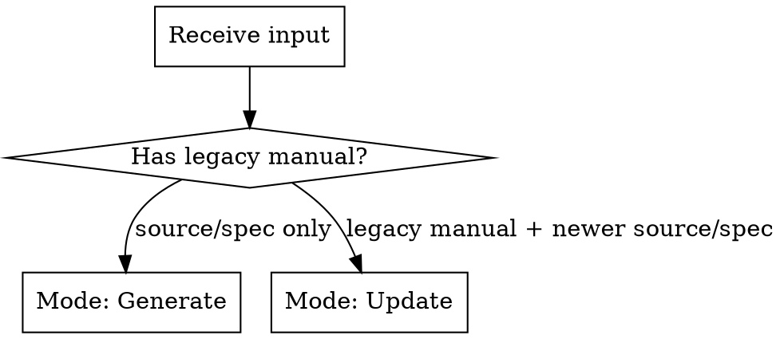
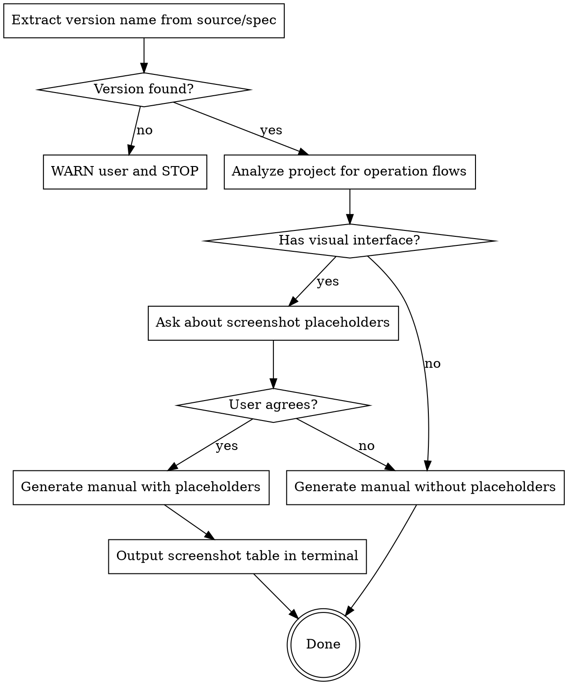
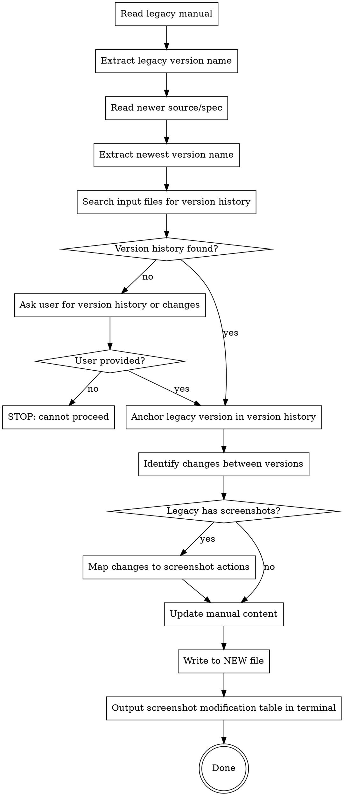

# Writing User Manuals

## Overview

Generate or update detailed, non-technical-user-friendly user manuals from project source code or spec documents. **Structure the manual around user operation flows**, not technical modules. Write for people who have never used the system before.

## When to Use

- User provides source code or spec documents and asks for a new user manual
- User provides an existing legacy manual AND newer source code/spec documents to update the manual
- User asks for "user guide", "usage manual", "用户手册", "使用指南", "更新手册"

## Mode Selection



---

## Mode 1: Generate New Manual

### Workflow



### Step 1: Extract and Validate Version Name

**MANDATORY first step.** Search the source code or spec documents for the project version name. Common locations:

- Config files: `package.json`, `setup.py`, `Cargo.toml`, `pubspec.yaml`, `build.gradle`
- Version constants or enums in source code
- Spec document headers or version iteration tables
- Git tags (`git tag --sort=-version:refname | head -5`)
- `CHANGELOG.md`, `RELEASES.md`, or release notes

**If version name NOT found:**

1. STOP immediately
2. Warn the user with a clear message:

> 无法在提供的源代码/规格文档中找到版本名称。用户手册必须关联一个明确的版本名称。请确认项目包含版本信息（如版本号、版本名称、发布标签等）后再重试。

3. Do NOT proceed with manual generation until the user provides or confirms a version name.

**If version name found:** Record it. It will be included in the manual header.

### Step 2: Analyze Project for Operation Flows

Read the provided source code or spec documents to understand:

- What the project does (core value proposition)
- Target users and their roles
- **User operation flows** — complete end-to-end journeys users take through the system
- All features organized by operation flow, not by technical module
- Error states and edge cases

Focus on answering: "What does the user DO?" not "What does the system HAVE?"

### Step 3: Determine Screenshot Needs

If the project has any visual interface (web UI, desktop app, CLI, TUI, mobile app):

Ask the user using AskUserQuestion:

> 您的项目包含图形界面/命令行界面，我可以在手册中插入"截图占位符"来标记需要截图的位置。占位符格式如下：
>
> 【图X：图片描述（什么功能模块、该功能模块目前的状态）】
>
> 这样您后续可以按照描述自行创建截图并插入到指定位置。请问是否需要生成截图占位符？

If user agrees -> include placeholders in the manual, then output screenshot table in terminal after writing the file.
If user declines -> generate manual without placeholders.

### Step 4: Generate the Manual

Follow the Manual Structure and Quality Standards below.

---

## Mode 2: Update Legacy Manual

### Prerequisites

Before starting, verify these inputs exist:

1. **Legacy user manual** — an existing user manual file (may contain screenshots)
2. **Newer source code/spec** — updated project documentation
3. **Version history** — see discovery steps below

### Version History Discovery

**Search the provided input files first.** Version history is often embedded in specs or source code. Search in this order:

1. **Spec documents** — version iteration tables, changelog sections, release notes, "版本历史" / "更新记录" headings
2. **Source code** — `CHANGELOG.md`, `RELEASES.md`, `HISTORY.md`, git commit messages, version comparison tables in documentation files

**If version history found in input files:** Proceed with Mode 2 workflow.

**If version history NOT found in any input file:** Ask the user using AskUserQuestion:

> 在提供的文件中未找到版本迭代历史。更新用户手册需要了解新旧版本之间的功能变更。请提供以下任一信息：
>
> 1. 版本迭代文档（包含功能变更记录的文件路径）
> 2. 版本变更的关键差异说明（如：新增了哪些功能、修改了哪些功能、删除了哪些功能）
>
> 或者您可以直接说明从旧版本到新版本的主要变更内容。

If the user provides the changes directly, use that as the version history. If the user cannot provide any version history, STOP — this mode cannot proceed without it.

### Workflow



### Step 1: Anchor Versions

Extract version names from both inputs:

- **Legacy manual** — the version the manual was written for (from manual header or metadata)
- **Newer source/spec** — the latest version

Anchor the legacy version in the version history. Determine the full scope of changes: everything from the legacy version up to the newest version.

### Step 2: Identify Changes

From version history, categorize each change:

| Change Type | Manual Action | Screenshot Impact |
|------------|---------------|-------------------|
| New feature | Add new section (follow Section Template) | Add new screenshot placeholders |
| Modified feature (UI changed) | Update section content + steps | Replace existing screenshots |
| Modified feature (logic only, same UI) | Update text, keep steps if flow unchanged | Keep existing screenshots |
| Removed feature | Remove section entirely | Remove screenshots |
| UI redesign (structural) | Rewrite affected sections | Replace all affected screenshots |
| Bug fix (user-facing) | Update affected steps if behavior changed | Replace if UI changed |
| Bug fix (internal) | No change needed | No change needed |

### Step 3: Handle Screenshots in Legacy Manual

When the legacy manual contains screenshots (`【图X：...】` placeholders or embedded images):

1. **Inventory** all existing screenshots from the legacy manual
2. **Map** each screenshot to its associated feature/section
3. **Cross-reference** with the change list from Step 2
4. **Determine action** for each screenshot: add, replace, remove, or keep

Update screenshot placeholders in the new manual:
- Renumber sequentially after additions/removals
- Update descriptions for replaced screenshots to reflect new UI states
- Remove placeholders for deleted features
- Add new placeholders for new features

### Step 4: Update Manual Content

1. Read the legacy manual structure
2. Apply changes based on identified differences
3. Add new sections for new features (follow Section Template below)
4. Update existing sections for modified features (focus on operation flow changes)
5. Remove sections for removed features
6. Update version name in the manual header to the newest version
7. **Write output to a NEW file** — never overwrite the legacy manual
8. Output the Screenshot Modification Table in terminal (NOT in the output file)

### Screenshot Modification Table

Output this table **directly in the terminal** after writing the new file. Do NOT include it in the output markdown file.

```
## 截图修改清单

| 序号 | 操作 | 所在章节 | 修改说明 |
|------|------|---------|---------|
| 图1  | 新增 | 第X章 新功能名称 | [截图描述：需要截取什么界面、展示什么状态] |
| 图3  | 替换 | 第2章 功能Y | 原截图展示旧版界面，需替换为新版截图 |
| 图7  | 删除 | 第4章 已移除功能 | 功能已删除，截图不再需要 |
| 图2  | 保留 | 第1章 系统登录 | 登录界面未变更，保留原有截图 |
```

Action types: **新增** (add), **替换** (replace), **删除** (remove), **保留** (keep)

---

## Manual Structure

### Version Header

**MANDATORY.** The version name extracted in Step 1 must appear in the manual. The manual is INVALID without a version name.

```markdown
# Project Name — 用户使用手册

**版本：V2.3.0**

---
```

### Required Sections (in order)

1. **欢迎使用** — **Must explicitly state the version name** (e.g., "本文档适用于 [Product Name] V2.3.0 版本"), followed by one paragraph: what is this system + 3 bullet points of key benefits
2. **产品概述** — Brief product introduction + Mermaid operation flowchart (see Product Introduction section below)
3. **目录** — Markdown anchor links to all major sections
4. **系统登录** — Login flow, error table, logout
5. **系统首页概览** — Main navigation, role-based menu differences
6. **Core Feature Sections** — Organized by **user operation flow**, one section per major flow
7. **常见问题解答** — FAQ organized by category
8. **快速上手清单** — 5-step checklist for first-time users

### Product Introduction (产品概述)

This section gives readers a quick understanding of the product before diving into details. It must include:

1. **One-paragraph introduction**: What the product is, who it's for, and what problem it solves
2. **Key capabilities**: 3-5 bullet points listing core functions
3. **Target users**: Brief mention of user roles (e.g., admin, operator, end user)
4. **Operation flowchart**: A Mermaid diagram showing the end-to-end user journey through the product

#### Product Introduction Template

```markdown
## 产品概述

[Product Name] 是一款 [product category/purpose]，面向 [target users]，旨在 [core value proposition]。

### 核心能力

- **[Capability 1]**：[Brief description]
- **[Capability 2]**：[Brief description]
- **[Capability 3]**：[Brief description]

### 目标用户

[User Role A]：[What this role does in the system]
[User Role B]：[What this role does in the system]

### 产品使用流程

以下流程图展示了 [Product Name] 的主要使用路径：

​```mermaid
flowchart TD
    A[用户登录] --> B{角色判断}
    B -->|管理员| C[系统管理]
    B -->|操作员| D[日常操作]
    C --> C1[用户管理]
    C --> C2[系统配置]
    D --> D1[核心业务流程A]
    D --> D2[核心业务流程B]
    D1 --> D1a[步骤1]
    D1 --> D1b[步骤2]
    D2 --> D2a[步骤1]
    D2 --> D2b[步骤2]
    D1b --> E[结果查看/导出]
    D2b --> E
​```
```

**Important**: The Mermaid flowchart must be derived from the actual project analysis. Each node should represent a meaningful user action or decision point, not a technical module. The flowchart should give readers a "map" of the entire product at a glance.

### Core Principle: Operation-Flow-First

**Organize sections by user operation flows, NOT by technical modules.**

| Bad (technical) | Good (operation flow) |
|-----------------|----------------------|
| 3.1 Database Module | 3.1 Creating a Course |
| 3.2 API Module | 3.2 Assigning Homework |
| 3.3 Frontend Module | 3.3 Reviewing Submissions |

Each section follows a complete user journey: **goal -> steps -> result**.

### Section Template for Features

Each feature section follows this pattern:

```markdown
## N. Feature Name

Brief explanation of what this feature does and why it matters to the user.

### N.1 Sub-feature or Action

Step-by-step instructions:
1. Action with **bold UI element names**
2. Next action...
3. Result or feedback

【图X：Screenshot description if placeholders enabled】

> **Tip/Note**: Helpful context in blockquote

### N.2 Another Sub-feature

| Column | Column | Column |
|--------|--------|--------|
| Data   | Data   | Data   |
```

---

## Quality Standards

### Writing Rules

- **Language**: Match the user's language (Chinese if spec is in Chinese, English if in English)
- **Tone**: Friendly, patient, never condescending. Write as if explaining to a colleague who's never seen the system
- **UI references**: Always **bold** UI element names (buttons, fields, menus): click **"Save"** button
- **Steps**: Use numbered lists for sequential actions, never skip steps
- **Navigation paths**: Use arrow notation: **Backend -> Courses -> Add Course**
- **Keyboard shortcuts**: Mention when relevant, format as: press **Enter** key
- **Operation flow focus**: Every section should answer "how does the user accomplish X?"

### Tables (use for)

- Feature comparison matrices
- Error message -> cause -> solution mappings
- Role permission differences
- Keyboard shortcut references
- Data field descriptions

### Blockquotes (use for)

- Tips and best practices
- Important warnings or caveats
- Context that helps but isn't part of the main flow
- Format: `> **说明**：...` or `> **注意**：...` or `> **提示**：...`

### Screenshot Placeholder Format

When enabled, use this exact format:

```
【图X：[功能模块名称] - [界面状态描述]，展示[具体UI元素列表]】
```

Examples:
- `【图1：登录页面全貌，展示系统Logo、用户名输入框、密码输入框、"登录"按钮的整体布局】`
- `【图5：答题结束后统计面板，展示选项分布柱状图、正确率圆环图、学生答题列表】`

### Screenshot Count Guidelines

| Project Size | Screenshot Count |
|-------------|-----------------|
| Small (1-5 features) | 5-10 screenshots |
| Medium (6-15 features) | 10-20 screenshots |
| Large (16+ features) | 20-30 screenshots |

Priority for screenshots:
1. Login/main entry page
2. Dashboard/home overview
3. Core feature main view
4. Key interaction states (during action, after action)
5. Complex forms or dialogs
6. Data visualization or result views
7. Settings/configuration pages

### Screenshot Table Output (Generate Mode)

After writing the manual to file, output the screenshot table **directly in the terminal** as a follow-up message to the user. Do NOT include this table in the markdown file.

Format:

```
## 截图清单

| 序号 | 占位符位置 | 截图描述 |
|------|-----------|---------|
| 图1  | 第1章 系统登录 | 登录页面全貌，展示Logo、输入框、按钮布局 |
| 图2  | 第2章 首页概览 | 后台管理页面，展示左侧菜单栏和内容区域 |
| ...  | ...       | ...     |
```

---

## Common Mistakes

| Mistake | Fix |
|---------|-----|
| Organizing by technical modules | Reorganize by user operation flows |
| Missing version name | Always extract and validate version before generating |
| Overwriting legacy manual in update mode | Always write to a new file |
| Skipping version validation | STOP if no version found in source/spec |
| Ignoring version history in update mode | Anchor versions to determine exact change scope |
| Writing for developers | Remove all technical jargon (API, endpoint, component) |
| Skipping error scenarios | Include error tables for every user-facing failure |
| Too few screenshots | At minimum: login, home, core feature, one result view |
| Vague screenshot descriptions | List specific UI elements visible in the screenshot |
| Missing FAQ | Always include FAQ section with real error messages |
| No quick start guide | End with a 5-step checklist for first-time users |
| Inconsistent UI naming | Always use the exact label from the spec/source code |
| Not outputting screenshot modification table in update mode | Always output the table in terminal after writing the file |
| Missing product overview section | Always include 产品概述 with introduction, capabilities, and Mermaid flowchart |
| Mermaid flowchart uses technical terms | Use user-facing action names, not module/API names |

---

## Example Output Structure

```markdown
# Project Name — 用户使用手册

**版本：V2.3.0**

---
## 欢迎使用
## 产品概述
## 目录
## 1. 系统登录
## 2. 系统首页概览
## 3-N. [Core Features organized by operation flow]
## N+1. 常见问题解答
## 快速上手清单
```
