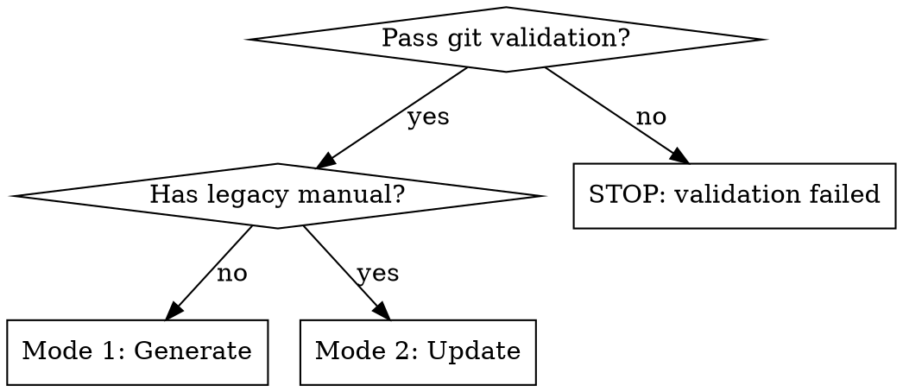
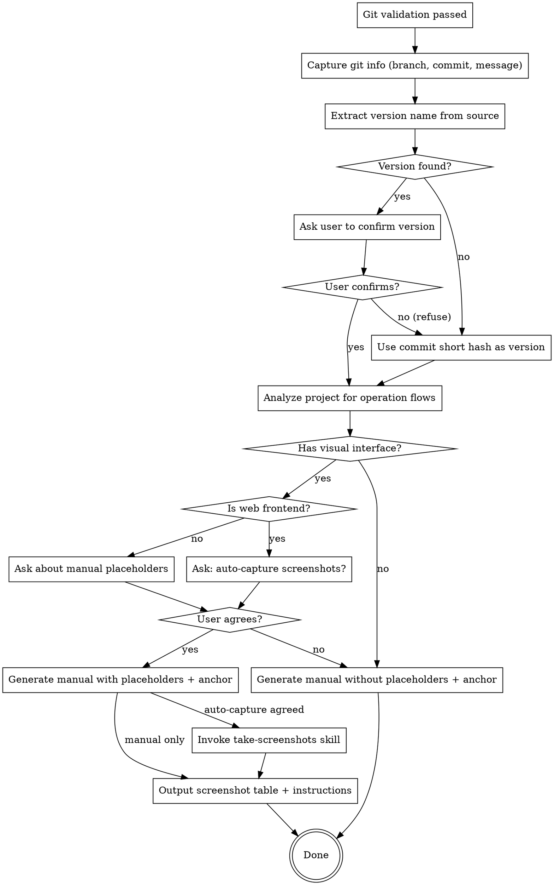
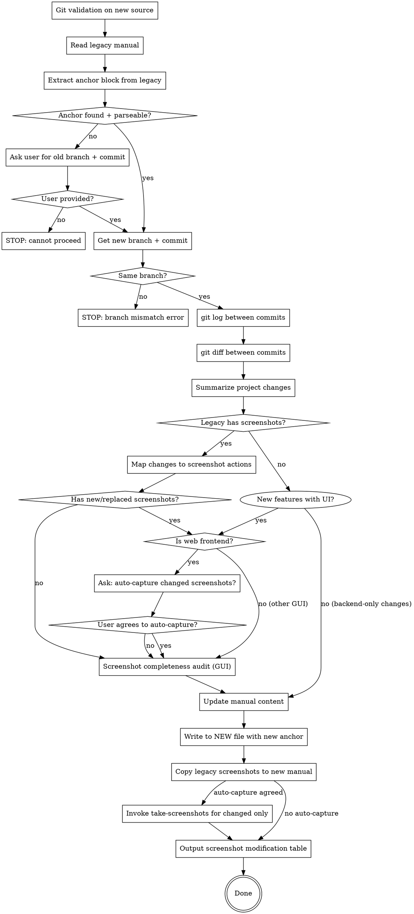

# Writing User Manuals

## Overview

Generate or update detailed, non-technical-user-friendly user manuals from project source code. **Structure the manual around user operation flows**, not technical modules. Write for people who have never used the system before.

**CRITICAL: The manual MUST be generated from user-provided project source code (a git repository).** The git commit history is the source of truth for version tracking. Each generated manual records its source branch, commit hash, and commit message in an `anchor` code block.

## When to Use

- User provides a git project path and asks for a new user manual
- User provides an existing manual AND a git project path to update the manual
- User asks for "user guide", "usage manual", "用户手册", "使用指南", "更新手册"

## Prerequisites: Source Code & Git Validation

**MANDATORY. Execute BEFORE mode selection. If any check fails, STOP immediately — do NOT proceed.**

### Check 1: Source Code Provided

The user MUST provide project source code (a directory path). If the user only provides spec documents, screenshots, or descriptions without source code:

> 错误：生成用户手册需要项目源码。您未提供项目源码路径。请提供完整的项目源码目录（一个 git 仓库），然后重试。

STOP. Do not continue.

### Check 2: Git Initialized

Run `git rev-parse --git-dir` in the project directory. If it fails:

> 错误：提供的项目路径未初始化 Git（`git rev-parse --git-dir` 失败）。用户手册必须基于 Git 仓库生成，以便追踪版本信息。请在项目中初始化 Git 并至少创建一个 commit 后重试。

STOP. Do not continue.

### Check 3: Has Commit Records

Run `git rev-parse HEAD` in the project directory. If it fails (no commits):

> 错误：项目没有任何 commit 记录（`git rev-parse HEAD` 失败）。用户手册需要基于已有的 commit 版本生成。请至少创建一个 commit 后重试。

STOP. Do not continue.

### Check 4: Clean Working Tree

Run `git diff HEAD` in the project directory. If there is ANY output (working tree is dirty):

> 错误：当前工作目录存在未提交的更改（`git diff HEAD` 不为空）。用户手册必须基于最新的 commit 版本生成，以确保文档与代码一致。请先提交或暂存所有更改，使工作目录干净后再重试。

STOP. Do not continue.

### Capture Git Info

Only after ALL four checks pass, capture these values (used later for the anchor block):

```bash
git rev-parse --abbrev-ref HEAD          # → branch name
git rev-parse HEAD                        # → full commit hash
git log -1 --format=%B                    # → commit message (may be multi-line)
```

---

## Mode Selection



---

## Anchor Block Specification

Every user manual generated or updated by this skill MUST include an anchor block at the very beginning of the file (before the title). This block records the exact git state the manual was generated from.

**Format:**

```
​```anchor
branch: <branch-name>
commit: <full-commit-hash>
message: <commit-message>
​```
```

**Example:**

```
​```anchor
branch: main
commit: abc123def456789012345678901234567890abcd
message: feat: add user authentication and role management
​```
```

**Rules:**
- The anchor block MUST be the first content in the file (after frontmatter if applicable)
- For multi-line commit messages, join them with spaces into a single line
- In Mode 2 (update), the old anchor block is overwritten with the new one
- If an old manual lacks an anchor block, Mode 2 cannot proceed automatically (see Mode 2 Step 1)

---

## Mode 1: Generate New Manual

### Workflow



### Step 0: Git Validation

Already completed in Prerequisites. The branch, commit hash, and commit message are captured and ready for the anchor block.

### Step 1: Determine Version Name

Try to find a human-readable version name from the source code. Common locations:

- Config files: `package.json`, `setup.py`, `Cargo.toml`, `pubspec.yaml`, `build.gradle`
- Version constants or enums in source code
- `CHANGELOG.md`, `RELEASES.md`, or release notes
- Git tags (`git tag --sort=-version:refname | head -5`)

**If version name found:** Ask user to confirm with `AskUserQuestion`:

> 在源代码中找到了版本名称：**V2.3.0**（来源：[file path or config key]）。请确认这是否正确？

Options: "确认，版本正确" / "版本不对，我来提供"

**If version name NOT found:** Use the short commit hash (first 7 characters) as the version identifier. No need to ask the user — proceed directly.

> 未在源代码中找到明确的版本名称，将使用 commit 短哈希 `abc1234` 作为版本标识。

### Step 2: Analyze Project for Operation Flows

Read the provided source code to understand:

- What the project does (core value proposition)
- Target users and their roles
- **User operation flows** — complete end-to-end journeys users take through the system
- All features organized by operation flow, not by technical module
- Error states and edge cases

Focus on answering: "What does the user DO?" not "What does the system HAVE?"

### Step 3: Determine Screenshot Needs

If the project has any visual interface (web UI, desktop app, CLI, TUI, mobile app):

**First, detect if the project qualifies for automatic screenshot capture.** The `auto-capture-for-webapp:take-screenshots` Skill can automatically capture real screenshots for web frontend projects. A project qualifies if ALL of:

- It is a **web frontend application** with a browser-based UI (HTML/CSS/JS, React, Vue, Angular, Next.js, etc.)
- The user provides **source code** (you can start the dev server) OR a **running URL**
- It is NOT a CLI app, desktop app, mobile app, or backend-only service

**If the project qualifies (web frontend):**

Ask the user using AskUserQuestion:

> 您的项目是 Web 前端应用，我可以使用 `auto-capture-for-webapp:take-screenshots` 为每个截图占位符自动截取真实的页面截图。请问是否需要自动截图？

- If user agrees → Generate manual with placeholders, then proceed to **Step 5: Auto-Capture Screenshots** after writing the manual.
- If user declines → Generate manual without placeholders (skip placeholders entirely).

**If the project does NOT qualify (CLI, TUI, desktop app, mobile app):**

Ask the user using AskUserQuestion:

> 您的项目包含图形界面/命令行界面，我可以在手册中插入"截图占位符"来标记需要截图的位置。占位符格式如下：
>
> 【图X：图片描述（什么功能模块、该功能模块目前的状态）】
>
> 这样您后续可以按照描述自行手动创建截图并插入到指定位置。截图需要用户手动创建（非 Web 前端项目无法使用自动化截图工具）。请问是否需要生成截图占位符？

- If user agrees → Include placeholders in the manual, then output screenshot table in both terminal and markdown file after writing.
- If user declines → Generate manual without placeholders.

**If the project has no visual interface (backend-only, library, API):**

Skip this step entirely. Generate manual without screenshots.

### Step 4: Generate the Manual

Follow the Manual Structure and Quality Standards below. **The anchor block MUST be the first content in the file.**

### Step 5: Auto-Capture Screenshots (Web Frontend Only)

**Only execute this step if** the user agreed to auto-capture in Step 3 AND the project qualifies as a web frontend.

After the manual markdown file is written with screenshot placeholders:

1. **Parse the placeholders**: Extract all `【图X：...】` placeholders and their corresponding `` image links from the generated manual. Build a mapping of figure number, description, and target filename.

2. **Invoke `auto-capture-for-webapp:take-screenshots`**: Use the `Skill` tool, passing the placeholder list as context (descriptions + target filenames).

3. **After screenshots are captured**, verify that the screenshot files exist in `screenshots/` with names matching the markdown image links.

4. **If any screenshots fail**, report which ones failed and why — the user can fill them in manually.

---

## Mode 2: Update Legacy Manual

### Prerequisites

Before starting, verify these inputs exist:

1. **Legacy user manual** — an existing user manual file
2. **Newer source code** — a git project directory (validated via Prerequisites checks)

### Workflow



### Step 1: Read and Understand the Legacy Manual

**CRITICAL: Read the ENTIRE legacy manual thoroughly before proceeding.** Do NOT just skim for the anchor block. You must understand:

- The full document structure (all sections, subsections, and their hierarchy)
- Every feature section and its content (operation flows, steps, tips, warnings)
- All screenshots: their count, locations, descriptions, and which features they belong to
- The writing style, tone, and terminology used throughout
- Any special sections (FAQs, quick start guides, appendices)

This full understanding is the foundation for accurate incremental updates. Without it, you risk:
- Duplicating content that already exists
- Missing sections that should be updated
- Creating inconsistent tone or terminology
- Mishandling the screenshot inventory

**After reading the full manual**, parse the `anchor` code block at the beginning of the file:

```
​```anchor
branch: <branch-name>
commit: <full-commit-hash>
message: <commit-message>
​```
```

Extract the `branch` and `commit` values.

**If the anchor block is found and parseable:** Record the old branch and old commit. Proceed to Step 2.

**If the anchor block is MISSING or cannot be parsed (missing branch/commit fields):**

Do NOT proceed automatically. Ask the user with `AskUserQuestion`:

> 旧用户手册中缺少有效的 `anchor` 代码块，无法确定旧手册是基于哪个分支的哪个 commit 生成的。请提供以下信息：
>
> 1. 旧手册对应的 **分支名称**
> 2. 旧手册对应的 **commit 编号**（完整的哈希值）
>
> 您可以在旧手册生成时的项目目录中运行 `git log --oneline` 查找对应的 commit。

If the user provides both branch and commit → use them as old branch/commit. Proceed to Step 2.
If the user cannot provide this information → STOP. Do not continue with update mode.

### Step 2: Compare Branches

Get the new source's branch and commit from the Prerequisites git validation (already captured).

Compare the old branch (from legacy anchor) with the new branch (from current source):

**If branches are DIFFERENT:**

> 错误：分支不匹配。旧手册基于分支 **`old-branch`**（commit `old-hash`）生成，而当前源码在分支 **`new-branch`**（commit `new-hash`）上。跨分支更新用户手册不受支持，因为两个分支的开发历史不可比。请切换到与旧手册相同的分支（`old-branch`）后重试，或在该分支上以 Mode 1 重新生成手册。

STOP. Do not continue.

**If branches are the SAME:** Proceed to Step 3.

### Step 3: Analyze Git History Between Commits

Use git commands to discover all changes between the old commit and the new commit:

```bash
# List all commits between old and new (oldest first)
git log --oneline <old-commit>..<new-commit>

# Show full commit messages between old and new
git log <old-commit>..<new-commit> --format="%h %s%n%b"

# Show file-level diff summary
git diff --stat <old-commit>..<new-commit>

# Show detailed diff (filter to meaningful files, skip lock files, dist, etc.)
git diff <old-commit>..<new-commit> -- . ':(exclude)package-lock.json' ':(exclude)yarn.lock' ':(exclude)dist/*' ':(exclude)node_modules/*'
```

**Summarize the project changes** by categorizing each commit and its file changes:

| Change Type | Manual Action | Screenshot Impact |
|------------|---------------|-------------------|
| New feature (new files, new UI) | Add new section (follow Section Template) | Add new screenshot placeholders |
| Modified feature (UI changed) | Update section content + steps | Replace existing screenshots |
| Modified feature (logic only, same UI) | Update text, keep steps if flow unchanged | Keep existing screenshots |
| Removed feature (files deleted) | Remove section entirely | Remove screenshots |
| UI redesign (structural layout changes) | Rewrite affected sections | Replace all affected screenshots |
| Bug fix (user-facing behavior change) | Update affected steps | Replace if UI changed |
| Bug fix (internal, no user impact) | No change needed | No change needed |
| Refactor/dependency/config changes | No change needed | No change needed |

**Report the summary to the user** before proceeding:

> 从旧 commit `abc1234` 到新 commit `def5678` 共发现 [N] 个 commit，变更总结如下：
>
> - 新增功能：[list new features]
> - 修改功能：[list modified features]
> - 删除功能：[list removed features]
> - UI 变更：[list UI changes]
> - 其他变更（无需更新手册）：[list refactors/bugfixes/etc.]
>
> 将基于以上变更更新用户手册。是否继续？

Wait for user confirmation before updating the manual content.

### Step 4: Handle Screenshots in Legacy Manual

**If the legacy manual contains screenshots** (`【图X：...】` placeholders or embedded images):

1. **Inventory** all existing screenshots from the legacy manual
2. **Map** each screenshot to its associated feature/section
3. **Cross-reference** with the change list from Step 3
4. **Determine action** for each screenshot: add, replace, remove, or keep

Update screenshot placeholders in the new manual:

- **CRITICAL: If ANY screenshot was added or deleted, renumber ALL screenshots from 图1 upward in ascending order.** Do not keep gaps or skip numbers. Every placeholder in the new manual must use sequential numbering (图1, 图2, 图3, ...). This ensures the final manual has a clean, continuous sequence. If screenshots only had their content replaced (same count, no additions/removals), keep the original numbering.
- Update descriptions for replaced screenshots to reflect new UI states
- Remove placeholders for deleted features
- Add new placeholders for new features

**If the legacy manual has NO screenshots:**

Check the change list from Step 3. If any changes involve new features with UI or UI modifications (categories marked "Add new screenshot placeholders" or "Replace existing screenshots"), the new manual should include screenshots. Fall back to Mode 1's screenshot determination logic:

1. **Check if the project has a visual interface.** If backend-only/library/API → skip screenshots entirely, proceed to Step 6.

2. **If the project qualifies as web frontend** (browser-based UI, source code available, not CLI/desktop/mobile):

   Ask the user using AskUserQuestion:

   > 旧版用户手册中没有截图，但本次更新涉及 [N] 个新增/修改的 UI 功能。您的项目是 Web 前端应用，我可以使用 `auto-capture-for-webapp:take-screenshots` 为这些功能自动截取页面截图。请问是否需要添加截图？
   
   - If user agrees → Add screenshot placeholders for new/modified features, then proceed to Step 5 and Step 7 (auto-capture after writing).
   - If user declines → Generate manual without screenshots. Skip to Step 6.

3. **If the project has a visual interface but is NOT a web frontend** (CLI, TUI, desktop app, mobile app):

   Ask the user using AskUserQuestion:

   > 旧版用户手册中没有截图，但本次更新涉及 [N] 个新增/修改的 UI 功能。我可以在手册中插入截图占位符来标记需要截图的位置。截图需要您手动创建（非 Web 前端项目无法使用自动化截图工具）。请问是否需要添加截图占位符？
   
   - If user agrees → Add screenshot placeholders for new/modified features. Proceed to Step 6 (no auto-capture).
   - If user declines → Generate manual without screenshots. Skip to Step 6.

### Step 4.5: Screenshot Completeness Audit (GUI Projects Only)

**If the project is a GUI type** (web frontend, desktop app, mobile app — anything with a visual user interface), perform a completeness audit after handling incremental screenshot changes. This ensures the manual has adequate screenshot coverage for ALL features, not just the ones that changed.

**Why this matters:** The old manual may have been generated without screenshots, or may be missing screenshots for some features even before this update. Incremental change analysis only catches what changed between commits — it won't flag a feature that has been undocumented (no screenshots) since the original manual was written.

**Audit process:**

1. **List all feature sections** in the updated manual (from Step 6's content plan). Each major feature section should have at least one screenshot.

2. **Compare against the screenshot inventory** (from Step 4 or the "legacy has no screenshots" branch). Identify features that lack screenshots:
   - A feature with a multi-step UI flow should have screenshots for key steps
   - Login page, home/dashboard, and core feature main views ALWAYS need screenshots

3. **For each gap found**, determine if it's a genuine missing screenshot. Skip backend-only features, configuration sections, or FAQ sections that don't have visual interfaces.

4. **Report gaps to the user** before updating content:

   > 截图完整性检查发现以下功能缺少截图（这些功能在旧手册中也没有截图）：
   >
   > - [Feature A]：[应该截取什么界面]
   > - [Feature B]：[应该截取什么界面]
   >
   > 请问是否需要为这些功能补充截图？

   - If user agrees → Add placeholders for missing screenshots. If web frontend, also offer auto-capture.
   - If user declines → Proceed without adding. Note the gaps in the terminal output so the user is aware.

5. **Renumber all screenshots** after adding any missing ones to maintain sequential numbering from 图1 upward.

**If the project is NOT a GUI type** (backend-only, library, API, CLI with no visual output): Skip this step entirely.

### Step 5: Determine Auto-Capture Eligibility (Update Mode)

After determining screenshot actions (新增/替换/保留/删除), check if auto-capture can be used for screenshots that need to change. The same qualification criteria as Mode 1 Step 3 apply:

- It is a **web frontend application** with a browser-based UI (HTML/CSS/JS, React, Vue, Angular, Next.js, etc.)
- The user provides **source code** (you can start the dev server) OR a **running URL**
- It is NOT a CLI app, desktop app, mobile app, or backend-only service

**If the project qualifies AND there are screenshots marked 新增 or 替换:**

Ask the user using AskUserQuestion:

> 您的项目是 Web 前端应用，本次手册更新涉及 [N] 张新增截图和 [M] 张需要替换的截图。我可以使用 `auto-capture-for-webapp:take-screenshots` 为这些变更的截图自动截取真实页面截图。保留下来的旧截图会从旧手册的 `screenshots/` 目录复制过来。
>
> 请问是否需要为变更的截图自动截图？

- If user agrees → Proceed to Step 6 and Step 7 (auto-capture after writing).
- If user declines → Proceed without auto-capture. New/replaced screenshots will be listed in the modification table for manual creation.

**If the project does NOT qualify (CLI, TUI, desktop, mobile, no source/URL):**

Skip auto-capture. All new/replaced screenshots must be created manually. Proceed to Step 6.

**If there are NO screenshots marked 新增 or 替换 (only 保留 and/or 删除):**

Skip auto-capture. No new screenshots needed. Proceed directly to Step 6.

### Step 6: Update Manual Content

1. Read the legacy manual structure
2. Apply changes based on the git history analysis from Step 3
3. Add new sections for new features (follow Section Template below)
4. Update existing sections for modified features (focus on operation flow changes)
5. Remove sections for removed features
6. **Replace the anchor block** with the new git info (new branch, new commit, new message)
7. Update the version name in the manual header
8. **Write output to a NEW file** — never overwrite the legacy manual
9. **Copy screenshot files from the legacy manual** — if the legacy manual has associated screenshot files (in its `screenshots/` directory), copy all **kept** screenshots to the new manual's `screenshots/` directory. For **replaced** screenshots: copy them too as fallback (they will be overwritten if auto-capture is used in Step 7). For **新增** screenshots: they will be captured by auto-capture (Step 7) if the user agreed, otherwise the user creates them manually.
10. Output the Screenshot Modification Table in terminal (NOT in the output file)

### Screenshot Modification Table

Output this table **directly in the terminal** after writing the new file. Do NOT include it in the output markdown file.

If auto-capture was used (Step 7), add "（已自动截取）" suffix to the 修改说明 for successfully captured screenshots, and "（自动截取失败，需手动创建）" for failed ones.

```
## 截图修改清单

| 序号 | 操作 | 所在章节 | 修改说明 |
|------|------|---------|---------|
| 图1  | 新增 | 第X章 新功能名称 | [截图描述：需要截取什么界面、展示什么状态]（已自动截取） |
| 图3  | 替换 | 第2章 功能Y | 原截图展示旧版界面，需替换为新版截图（已自动截取） |
| 图7  | 删除 | 第4章 已移除功能 | 功能已删除，截图不再需要 |
| 图2  | 保留 | 第1章 系统登录 | 登录界面未变更，保留原有截图 |
```

Action types: **新增** (add), **替换** (replace), **删除** (remove), **保留** (keep)

### Step 7: Auto-Capture for Changed Screenshots (Update Mode, Web Frontend Only)

**Only execute this step if** the user agreed to auto-capture in Step 5 AND there are screenshots marked 新增 or 替换.

After Steps 4-6 are complete (manual written to NEW file, legacy screenshots copied):

1. **Identify target screenshots**: From the modification table, extract only the screenshots marked **新增** or **替换**. Screenshots marked **保留** are already copied from the legacy manual.

2. **Build the capture list**: For each 新增 or 替换 screenshot, extract figure number, description, and target filename from the placeholder and image link.

3. **Invoke `auto-capture-for-webapp:take-screenshots`**: Use the `Skill` tool, passing ONLY the changed screenshot list (not the kept ones). Include context that existing screenshots in `screenshots/` must be preserved (they include kept screenshots from the legacy manual).

4. **After screenshots are captured**, verify the captured files exist in `screenshots/` alongside the kept screenshots.

5. **If any captures fail**, report which ones — the user can fill them in manually.

6. **Update the screenshot modification table**: mark auto-captured screenshots with "（已自动截取）", failed ones with "（自动截取失败，需手动创建）".

---

## Manual Structure

### Anchor Block (MANDATORY — First Content)

The anchor block MUST be the very first content in every generated manual file:

```
​```anchor
branch: main
commit: abc123def456789012345678901234567890abcd
message: feat: add user authentication and role management
​```
```

### Version Header

```markdown
# Project Name — 用户使用手册

**版本：V2.3.0**

---
```

### Required Sections (in order)

1. **欢迎使用** — **Must explicitly state the version name** (e.g., "本文档适用于 [Product Name] V2.3.0 版本"), followed by one paragraph: what is this system + 3 bullet points of key benefits
2. **产品概述** — Brief product introduction + Mermaid operation flowchart (see Product Introduction section below)
3. **目录** — Markdown anchor links to all major sections
4. **系统登录** — Login flow, error table, logout
5. **系统首页概览** — Main navigation, role-based menu differences
6. **Core Feature Sections** — Organized by **user operation flow**, one section per major flow
7. **常见问题解答** — FAQ organized by category
8. **快速上手清单** — 5-step checklist for first-time users

### Product Introduction (产品概述)

This section gives readers a quick understanding of the product before diving into details. It must include:

1. **One-paragraph introduction**: What the product is, who it's for, and what problem it solves
2. **Key capabilities**: 3-5 bullet points listing core functions
3. **Target users**: Brief mention of user roles (e.g., admin, operator, end user)
4. **Operation flowchart**: A Mermaid diagram showing the end-to-end user journey through the product

#### Product Introduction Template

```markdown
## 产品概述

[Product Name] 是一款 [product category/purpose]，面向 [target users]，旨在 [core value proposition]。

### 核心能力

- **[Capability 1]**：[Brief description]
- **[Capability 2]**：[Brief description]
- **[Capability 3]**：[Brief description]

### 目标用户

[User Role A]：[What this role does in the system]
[User Role B]：[What this role does in the system]

### 产品使用流程

以下流程图展示了 [Product Name] 的主要使用路径：

​```mermaid
flowchart TD
    A[用户登录] --> B{角色判断}
    B -->|管理员| C[系统管理]
    B -->|操作员| D[日常操作]
    C --> C1[用户管理]
    C --> C2[系统配置]
    D --> D1[核心业务流程A]
    D --> D2[核心业务流程B]
    D1 --> D1a[步骤1]
    D1 --> D1b[步骤2]
    D2 --> D2a[步骤1]
    D2 --> D2b[步骤2]
    D1b --> E[结果查看/导出]
    D2b --> E
​```
```

**Important**: The Mermaid flowchart must be derived from the actual project analysis. Each node should represent a meaningful user action or decision point, not a technical module. The flowchart should give readers a "map" of the entire product at a glance.

### Core Principle: Operation-Flow-First

**Organize sections by user operation flows, NOT by technical modules.**

| Bad (technical) | Good (operation flow) |
|-----------------|----------------------|
| 3.1 Database Module | 3.1 Creating a Course |
| 3.2 API Module | 3.2 Assigning Homework |
| 3.3 Frontend Module | 3.3 Reviewing Submissions |

Each section follows a complete user journey: **goal -> steps -> result**.

### Section Template for Features

Each feature section follows this pattern:

```markdown
## N. Feature Name

Brief explanation of what this feature does and why it matters to the user.

### N.1 Sub-feature or Action

Step-by-step instructions:
1. Action with **bold UI element names**
2. Next action...
3. Result or feedback

【图X：Screenshot description if placeholders enabled】


> **Tip/Note**: Helpful context in blockquote

### N.2 Another Sub-feature

| Column | Column | Column |
|--------|--------|--------|
| Data   | Data   | Data   |
```

---

## Quality Standards

### Writing Rules

- **Language**: Match the user's language (Chinese if spec is in Chinese, English if in English)
- **Tone**: Friendly, patient, never condescending. Write as if explaining to a colleague who's never seen the system
- **UI references**: Always **bold** UI element names (buttons, fields, menus): click **"Save"** button
- **Steps**: Use numbered lists for sequential actions, never skip steps
- **Navigation paths**: Use arrow notation: **Backend -> Courses -> Add Course**
- **Keyboard shortcuts**: Mention when relevant, format as: press **Enter** key
- **Operation flow focus**: Every section should answer "how does the user accomplish X?"

### Tables (use for)

- Feature comparison matrices
- Error message -> cause -> solution mappings
- Role permission differences
- Keyboard shortcut references
- Data field descriptions

### Blockquotes (use for)

- Tips and best practices
- Important warnings or caveats
- Context that helps but isn't part of the main flow
- Format: `> **说明**：...` or `> **注意**：...` or `> **提示**：...`

### Screenshot Placeholder Format

When enabled, use this exact format — each placeholder MUST be followed by a markdown image link pointing to `screenshots/` directory:

```
【图X：[功能模块名称] - [界面状态描述]，展示[具体UI元素列表]】


```

The image filename uses the pattern `X-descriptive-name.png` where X is the figure number and the name is a short English slug describing the screenshot.

Examples:
- `【图1：登录页面全貌，展示系统Logo、用户名输入框、密码输入框、"登录"按钮的整体布局】` followed by ``
- `【图5：答题结束后统计面板，展示选项分布柱状图、正确率圆环图、学生答题列表】` followed by ``

### Screenshot Count Guidelines

| Project Size | Screenshot Count |
|-------------|-----------------|
| Small (1-5 features) | 5-10 screenshots |
| Medium (6-15 features) | 10-20 screenshots |
| Large (16+ features) | 20-30 screenshots |

Priority for screenshots:
1. Login/main entry page
2. Dashboard/home overview
3. Core feature main view
4. Key interaction states (during action, after action)
5. Complex forms or dialogs
6. Data visualization or result views
7. Settings/configuration pages

### Screenshot Table Output (Generate Mode)

After writing the manual to file, output the screenshot table **both in the terminal AND in the manual markdown file** (append at the end, before the 快速上手清单 section if present, otherwise at the very end of the file).

Format:

```
## 截图清单

| 序号 | 占位符位置 | 截图描述 | 文件名 |
|------|-----------|---------|--------|
| 图1  | 第1章 系统登录 | 登录页面全貌，展示Logo、输入框、按钮布局 | screenshots/1-login-page.png |
| 图2  | 第2章 首页概览 | 后台管理页面，展示左侧菜单栏和内容区域 | screenshots/2-home-overview.png |
| ...  | ...       | ...     | ...    |
```

The table in the markdown file must include the same four columns (序号, 占位符位置, 截图描述, 文件名) so the user can track which screenshot files need to be created.

### Screenshot Saving Instructions (Generate Mode)

**If auto-capture was used (web frontend, Step 5 executed):** Do NOT output manual screenshot instructions. The screenshots have already been captured automatically. Instead, confirm:

> 截图已通过自动化工具截取完成，保存在 `screenshots/` 目录下。请检查截图内容是否符合预期，如有需要可手动替换。

**If manual placeholders were used (non-web project):** After outputting the screenshot table, always output the following instructions to the user in the terminal:

```
## 截图保存说明

截图需要用户手动创建，按照以下步骤操作：

1. 在手册 Markdown 文件同级目录下创建 `screenshots/` 文件夹
2. 按照截图清单中的「文件名」列，手动截图并保存为对应的 PNG 文件
   - 文件名格式：`X-descriptive-name.png`（如 `1-login-page.png`）
   - X 为截图序号，必须与占位符中的图号一致
3. 确保 `screenshots/` 文件夹与手册 Markdown 文件在同一目录层级，Markdown 中的图片链接才能正常显示
```

This ensures the user knows exactly where to put screenshots and what to name them so the markdown image links resolve correctly.

---

## Common Mistakes

| Mistake | Fix |
|---------|-----|
| Proceeding without source code | STOP and error — source code (git repo) is mandatory |
| Proceeding with dirty working tree | STOP and error — `git diff HEAD` must be empty |
| Proceeding with no git commits | STOP and error — project must have at least one commit |
| Missing anchor block in generated manual | Always write the anchor block as the first content in the file |
| Anchor block has wrong format | Use exact format: branch, commit, message fields |
| Mode 2: proceeding without parsing anchor | If old manual has no anchor or it's malformed, ask user for old branch + commit |
| Mode 2: proceeding across different branches | STOP and error — branches must match; cross-branch updates are unsupported |
| Mode 2: not running git log/diff | Always run `git log` and `git diff` between old and new commits to summarize changes |
| Mode 2: not reporting change summary to user | Always present the git history analysis to user before updating manual content |
| Organizing by technical modules | Reorganize by user operation flows |
| Overwriting legacy manual in update mode | Always write to a new file |
| Writing for developers | Remove all technical jargon (API, endpoint, component) |
| Skipping error scenarios | Include error tables for every user-facing failure |
| Too few screenshots | At minimum: login, home, core feature, one result view |
| Vague screenshot descriptions | List specific UI elements visible in the screenshot |
| Missing FAQ | Always include FAQ section with real error messages |
| No quick start guide | End with a 5-step checklist for first-time users |
| Inconsistent UI naming | Always use the exact label from the spec/source code |
| Not renumbering screenshots from 图1 after additions/removals | When screenshots are added or removed, renumber ALL screenshots from 图1 upward sequentially |
| Not copying legacy screenshots to new manual directory | Copy all kept/replaced screenshots from legacy `screenshots/` to new manual's `screenshots/` directory |
| Not outputting screenshot modification table in update mode | Always output the table in terminal after writing the file |
| Missing product overview section | Always include 产品概述 with introduction, capabilities, and Mermaid flowchart |
| Missing image link below placeholder | Every 【图X：...】 must have a matching `` on the next line |
| Screenshot table only in terminal | Must output screenshot table in BOTH terminal and markdown file |
| Mermaid flowchart uses technical terms | Use user-facing action names, not module/API names |
| Not using auto-capture for web frontend projects | When project qualifies (web frontend + source/URL), offer auto-capture via `auto-capture-for-webapp:take-screenshots` before falling back to manual placeholders |
| Not invoking take-screenshots skill after generating manual | When auto-capture is agreed, invoke `Skill` tool with `auto-capture-for-webapp:take-screenshots` immediately after writing the manual file |
| Not checking auto-capture eligibility when updating manual | In update mode, if there are 新增/替换 screenshots and the project is a web frontend, offer auto-capture (Step 5) before writing the manual |
| Not invoking auto-capture for changed screenshots in update mode | When auto-capture is agreed in update mode, invoke `Skill` tool with `auto-capture-for-webapp:take-screenshots` for ONLY the 新增/替换 screenshots (not all screenshots) |
| Auto-capturing all screenshots in update mode (including kept ones) | Only capture 新增 and 替换 screenshots. 保留 screenshots are copied from legacy `screenshots/` directory. Capturing all wastes time and the kept pages may not have changed |
| Mode 2: skipping screenshots when legacy has none | Even if old manual has no screenshots, if new features have UI, fall back to Mode 1's screenshot logic — ask user about auto-capture or placeholders |
| Mode 2: not reading the full legacy manual | Read the ENTIRE manual before updating — understand structure, style, screenshots, and all feature sections to avoid duplicates, gaps, and inconsistency |
| Mode 2: skipping screenshot completeness audit for GUI projects | After handling incremental changes, audit ALL features for screenshot coverage. Features unchanged in this update may still lack screenshots from the original manual |

---

## Example Output Structure

```markdown
​```anchor
branch: main
commit: abc123def456789012345678901234567890abcd
message: feat: initial project setup with user authentication
​```

# Project Name — 用户使用手册

**版本：V2.3.0**

---
## 欢迎使用
## 产品概述
## 目录
## 1. 系统登录
## 2. 系统首页概览
## 3-N. [Core Features organized by operation flow]
## N+1. 常见问题解答
## 快速上手清单
```
